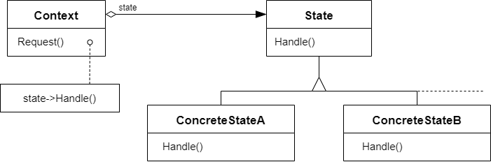

# 状态模式 State

## 动机

在软件构建过程中，某些对象的状态如果改变，其行为也会随之而发生变化，比如文档处于只读状态，其支持的行为和读写状态支持的行为就可能完全不同

:question: 如何在运行时根据对象的状态来透明地更改对象地行为？而不会为对象操作和状态转换之间引入紧耦合

## 模式定义

状态模式是一种行为设计模式，让你能在一个对象的内部状态变化时改变其行为，使其看上去就像改变了自身所属的类一样

<div align="center"></div>

## 例子

### 例 1

假设有三种网络状态，根据不同的操作状态会发生不同的变化，如下代码

```cpp
enum class NetworkState
{
    kOpen;
    kClose;
    kConnect;
};

class NetworkProcessor
{
    NetworkState state_;

public:
    void Operation1()
    {
        if (state_ == NetworkState::kOpen)
        {
            // ******
            state_ = NetworkState::kClose;
        }
        else if (state_ == NetworkState::kClose)
        {
            // ******
            state_ = NetworkState::kConnect;
        }
        else if (state_ == NetworkState::kConnect)
        {
            // ******
            state_ = NetworkState::Open;
        }
    }

    // 不同操作，状态变化不同
    void Operation2() {}
    void Operation3() {}
};
```

观察上述代码不难发现，状态数增加，会导致 if else 结构变得更加复杂，可对所有状态抽象出一个基类

```cpp
class NetworkState
{
private:
    NetworkState* next_;

public:
    virtual ~NetworkState() {}
    virtual void Operation1() = 0;
    virtual void Operation2() = 0;
    virtual void Operation3() = 0;

    NetworkState* GetNextState()
    {
        return next_;
    }
};

// 开启状态
class OpenState : public NetworkState
{
    static NetworkState* instance_;

public:
    static NetworkState* GetInstance()
    {
        if (instance_ == nullptr)
            instance_ = new OpenState();
        return instance_;
    }

    void Operation1()
    {
        // ******
        next_ = CloseState::GetInstance();
    }
    void Operation2()
    {
        // ******
        next_ = ConnectState::GetInstance();
    }
    void Operation3()
    {
        // ******
        next_ = OpenState::GetInstance();
    }
};
class CloseState : public NetworkState {};
class ConnectState : public NetworkState {};

class NetworkProcessor
{
    NetworkState* state_;
public:
    NetworkProcessor(NetworkState* state)
    {
        state_ = state;
    }
    void Operation1()
    {
        // ...
        state_->Operation1();
        state_ = state_.GetNextState();
    }
    void Operation2()
    {
        // ...
        state_->Operation2();
        state_ = state_.GetNextState();
    }
    void Operation3()
    {
        // ...
        state_->Operation3();
        state_ = state_.GetNextState();
    }
};
```

### 例 2

```cpp
#include <iostream>
#include <typeinfo>

class Context;
class State
{
protected:
    Context* context_;

public:
    virtual ~State() {}

    void SetContext(Context* context)
    {
        context_ = context;
    }

    virtual void Handle1() = 0;
    virtual void Handle2() = 0;
};

class Context
{
private:
    State* state_;

public:
    Context(State* state) :
        state_(nullptr)
    {
        TransitionTo(state);
    }
    ~Context()
    {
        delete state_;
    }

    void TransitionTo(State* state)
    {
        std::cout << "Context: TransitionTo to " << typeid(*state).name() << ".\n";
        if (state_ != nullptr)
            delete state_;
        state_ = state;
        state_->SetContext(this);
    }

    void Request1()
    {
        state_->Handle1();
    }

    void Request2()
    {
        state_->Handle2();
    }
};

class ConcreteStateA : public State
{
public:
    void Handle1() override;
    void Handle2() override
    {
        std::cout << "ConcreteStateA handles request2.\n";
    }
};

class ConcreteStateB : public State
{
public:
    void Handle1() override
    {
        std::cout << "ConcreteStateB handles request1.\n";
    }
    void Handle2() override
    {
        std::cout << "ConcreteStateB handles request2.\n";
        std::cout << "ConcreteStateB wants to change the state of the context.\n";
        context_->TransitionTo(new ConcreteStateA);
    }
};

void ConcreteStateA::Handle1()
{
    std::cout << "ConcreteStateA handles request1.\n";
    std::cout << "ConcreteStateA wants to change the state of the context.\n";
    context_->TransitionTo(new ConcreteStateB);
}

void ClientCode()
{
    Context* context = new Context(new ConcreteStateA);
    context->Request1();
    context->Request2();
    delete context;
}

int main(int argc, char* argv[])
{
    ClientCode();
    return 0;
}
```

## 应用场景

- 如果对象需要根据自身当前状态进行不同行为，同时状态的数量非常多且与状态相关的代码会频繁变更的话，可使用状态模式  
  模式建议你将所有特定于状态的代码抽取到一组独立的类中。这样一来，你可以在独立于其他状态的情况下添加新状态或修改已有状态，从而减少维护成本
- 如果某个类需要根据成员变量的当前值改变自身行为，从而需要使用大量的条件语句时，可使用该模式  
  状态模式会将这些条件语句的分支抽取到相应状态类的方法中。同时，你还可以清除主要类中与特定状态相关的临时成员变量和帮手方法代码
- 当相似状态和基于条件的状态机转换中存在许多重复代码时，可使用状态模式  
  状态模式让你能够生成状态类层次结构，通过将公用代码抽取到抽象基类中来减少重复

## 要点总结

- State 模式将所有与一个特定状态相关地行为都放入一个 State 的子类对象中，在对象状态切换时，切换相应的对象；但同时维持 State 的接口，这样实现了具体操作与状态转换之间的解耦
- 为不同的状态引入不同的对象使得状态转换变得更加明确，而且可以保证不会出现状态不一致的情况，因为转换是原子性的--即要么彻底转换过来，要么不转换
- 如果 State 对象没有实例变量，那么各个上下文可以共享同一个 State 对象，从而节省对象开销

## 与其他模式的关系

- `桥模式`、`状态模式`和`策略模式`（在某种程度上包括`适配器`）模式的接口非常相似。实际上，它们都基于组合模式——即将工作委派给其他对象，不过也各自解决了不同的问题。模式并不只是以特定方式组织代码的配方，你还可以使用它们来和其他开发者讨论模式所解决的问题
- `状态`可被视为`策略`的扩展。两者都基于组合机制：它们都通过将部分工作委派给“帮手”对象来改变其在不同情景下的行为。`策略`使得这些对象相互之间完全独立，它们不知道其他对象的存在。但`状态模式`没有限制具体状态之间的依赖，且允许它们自行改变在不同情景下的状态
