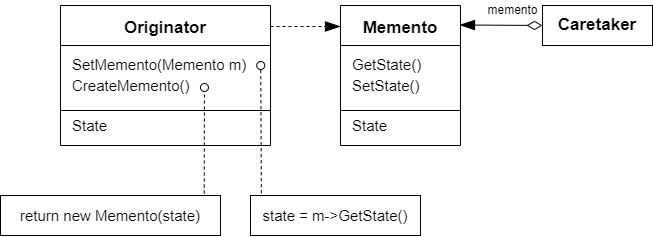

# 备忘录模式 Memento

## 动机

在软件构建过程中，某些对象的状态在转换过程中，可能由于某种需要，要求程序能够回溯到对象之前处于某个点时的状态。如果使用一些公有接口来让其他对象得到对象的状态，便会暴露对象的细节实现

:question: 如何实现对象状态的良好保存与恢复？但同时又不会因此而破坏对象本身的封装性

## 模式定义

备忘录模式是一种行为设计模式。在不破坏封装性的前提下，捕获一个对象的内部状态，并在该对象之外保存这个状态。这样以后就可以将该对象恢复到原先保存的状态

<div align="center"></div>

## 例子

### 例 1

```cpp
class Memento
{
private:
    string state_;
public:
    Memento(const string& s) : state_(s) {}
    string GetState() const { return state_; }
    void SetState(const string& s) { state_ = s; }
};

class Originator
{
private:
    string state_;
public:
    Originator() {}
    Memento CreateMomento()
    {
        Memento m(state_);
        return m;
    }
    void SetMomento(const Memento& m)
    {
        state_ = m.GetState();
    }
};


// 使用
int main()
{
    Originator originator;
    // 捕获对象状态，存储到备忘录
    Memento mem = originator.CreateMomento();

    // .. 改变orginator状态

    // 从备忘录中恢复
    originator.SetMomento(memento);
}
```

### 例 2

```cpp
#include <cstdlib>
#include <ctime>
#include <random>
#include <string>
#include <iostream>

class Memento
{
public:
    virtual ~Memento() {}
    virtual std::string GetName() const = 0;
    virtual std::string Date() const = 0;
    virtual std::string State() const = 0;
};

class ConcreteMemento : public Memento
{
private:
    std::string state_;
    std::string date_;

public:
    ConcreteMemento(std::string state) :
        state_(state)
    {
        std::time_t now = std::time(0);
        date_ = std::ctime(&now);
    }

    std::string GetName() const override
    {
        return date_ + " / (" + state_.substr(0, 9) + "...)";
    }
    std::string Date() const override
    {
        return date_;
    }
    std::string State() const override
    {
        return state_;
    }
};

class Originator
{
private:
    std::string state_;

    std::string GenerateRandomString(int length = 10)
    {
        const char alphanum[] = "0123456789ABCDEFGHIJZLMNOPQRSTUVWXZYabcdefghijzlmnopqrstuvwxzy";
        int string_length = sizeof(alphanum) + 1;
        std::string random_string;
        for (int i = 0; i < length; ++i)
            random_string += alphanum[std::rand() % string_length];
        return random_string;
    }

public:
    Originator(std::string state) :
        state_(state)
    {
        std::cout << "Originator: My initial state is: " << state_ << "\n";
    }

    void DoSomething()
    {
        std::cout << "Originator: I'm doing something important.\n";
        state_ = GenerateRandomString(30);
        std::cout << "Originator: and my state has changed to: " << state_ << std::endl;
    }

    Memento* Save()
    {
        return new ConcreteMemento(state_);
    }

    void Restore(Memento* memento)
    {
        state_ = memento->State();
        std::cout << "Originator: My state has changed to: " << state_ << "\n";
    }
};

class Caretaker
{
private:
    std::vector<Memento*> mementos_;
    Originator* originator_;

public:
    Caretaker(Originator* originator) :
        originator_(originator) {}
    ~Caretaker()
    {
        for (auto m : mementos_)
            delete m;
    }

    void Backup()
    {
        std::cout << "\nCaretaker: Saving Originator's state...\n";
        mementos_.push_back(originator_->Save());
    }
    void Undo()
    {
        if (!mementos_.size())
            return;
        Memento* memento = mementos_.back();
        std::cout << "Caretaker: Restoring state to: " << memento->GetName() << "\n";
        try
        {
            originator_->Restore(memento);
        }
        catch (...)
        {
            Undo();
        }
    }
    void ShowHistory() const
    {
        std::cout << "Caretaker: Here's the list of mementos:\n";
        for (auto m : mementos_)
            std::cout << m->GetName() << "\n";
    }
};

void ClientCode()
{
    Originator* originator = new Originator("Super-duper-super-puper-super.");
    Caretaker* caretaker = new Caretaker(originator);
    caretaker->Backup();
    originator->DoSomething();
    caretaker->Backup();
    originator->DoSomething();
    caretaker->Backup();
    originator->DoSomething();
    std::cout << "\n";
    caretaker->ShowHistory();
    std::cout << "\nClient: Now, let's rollback!\n\n";
    caretaker->Undo();
    std::cout << "\nClient: Once more!\n\n";
    caretaker->Undo();

    delete originator;
    delete caretaker;
}

int main(int argc, char* argv[])
{
    std::srand(static_cast<unsigned int>(std::time(nullptr)));
    ClientCode();
    return 0;
}
```

- 当你需要创建对象状态快照来恢复其之前的状态时，可以使用备忘录模式  
   备忘录模式允许你复制对象中的全部状态（包括私有成员变量），并将其独立于对象进行保存。尽管大部分人因为“撤销”这个用例才记得该模式，但其实它在处理事务（比如需要在出现错误时回滚一个操作）的过程中也必不可少
- 当直接访问对象的成员变量、获取器或设置器将导致封装被突破时，可以使用该模式  
  备忘录让对象自行负责创建其状态的快照。任何其他对象都不能读取快照，这有效地保障了数据的安全性

## 优缺点

| <div style="width:150px">优点</div>                                                                                | 缺点                                                                                                                                                                                                                  |
| ------------------------------------------------------------------------------------------------------------------ | --------------------------------------------------------------------------------------------------------------------------------------------------------------------------------------------------------------------- |
| 1. 可以在不破坏对象封装情况的前提下创建对象状态快照 <br> 2. 可以通过让负责人维护原发器状态历史记录来简化原发器代码 | 1. 如何客户端过于频繁地创建备忘录，程序将消耗大量内存 <br> 2. 负责人必须完整跟踪原发器的生命周期，这样才能销毁弃用的备忘录 <br> 3. 绝大部分动态编程语言（如 PHP、Python 和 JavaScript）不能确保备忘录中的状态不被修改 |

## 要点总结

- 备忘录（Memento）存储原发器（Originator）对象的内部状态，在需要时恢复原发器状态
- Memento 模式的核心是信息隐藏，即 Originator 需要向外接隐藏信息，保持其封装性。但同时又需要将状态保持到外界
- 由于现代语言（如 C#、Java 等）运行时都具有相当的对象序列化支持，因此往往采用效率较高、又较容易正确实现的序列化方案来实现 Memento 模式

## 与其他模式的关系

- 你可以同时使用`命令模式`和`备忘录模式`来实现 “撤销”。在这种情况下，`命令`用于对目标对象执行各种不同的操作，`备忘录`用来保存一条命令执行前该对象的状态
- 可以同时使用`备忘录模式`和`迭代器模式`来获取当前迭代器的状态，并且在需要的时候进行回滚
- 有时候`原型`可以作为`备忘录模式`的一个简化版本，其条件是你需要在历史记录中存储的对象状态比较简单，不需要链接其他外部资源，或者链接可以方便地重建
