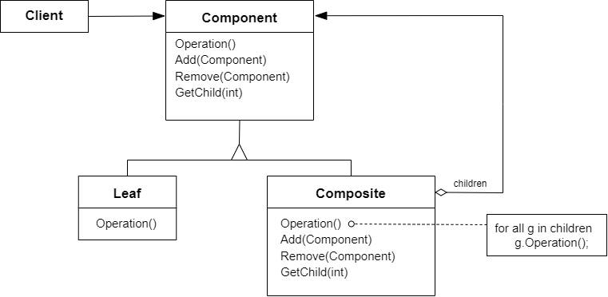

# 组合模式 Composite

## 动机

在软件在某些情况下，客户代码过多地依赖于对象容器复杂的内部实现结构，对象容器内部实现结构（而非抽象接口）的变化将引起客户代码的频繁变化，带来了代码的维护性、扩展性等弊端

:question: 如何将“客户代码与复杂的对象容器结构”解耦？让对象容器自己来实现自身的复杂结构，从而使得客户代码就像处理对象容器？

## 模式定义

组合模式是一种结构型设计模型，可以使用它将对象组合成树状结构，并且能像使用独立对象一样使用它们  
将对象组合成树形结构以表示“部分-整体”的层次结构，Composite 使得用户对单个对象和组合对象的使用具有一致性（稳定）

<div align="center"></div>

## 例子

### 例 1

```cpp
#include <iostream>
#include <list>
#include <string>
#include <algorithm>

using namespace std;

class Component
{
public:
    virtual ~Component() {}

    virtual void Process() = 0;
};

// 鐖惰妭鐐?class Composite : public Component
{
private:
    string name_;
    list<Component*> element_;

public:
    Composite(const string& s) :
        name_(s) {}

    void Add(Component* element)
    {
        element_.push_back(element);
    }
    void Remove(Component* element)
    {
        element_.remove(element);
    }
    void Process()
    {
        // 1. process current node
        // 2. process leaf nodes
        cout << "Composite process ... " << endl;
        for (auto& e : element_)
            e->Process();
    }
};

class Leaf : public Component
{
private:
    string name_;

public:
    Leaf(string s) :
        name_(s) {}
    void Process() { cout << "Leaf process ... " << endl; }
};

void Invoke(Component& c)
{
    c.Process();
}

int main(int argc, char* argv[])
{
    Composite root("root");
    Composite tree_node1("tree_node1");
    Composite tree_node2("tree_node2");
    Composite tree_node3("tree_node3");
    Composite tree_node4("tree_node4");
    Leaf leaf1("leaf1");
    Leaf leaf2("leaf2");

    root.Add(&tree_node1);
    tree_node1.Add(&tree_node2);
    tree_node2.Add(&leaf1);

    root.Add(&tree_node3);
    tree_node3.Add(&tree_node4);
    tree_node4.Add(&leaf2);

    Invoke(root);
    Invoke(leaf2);
    return 0;
}
```

## 应用场景

- 如果你需要实现树状对象结构，可以使用组合模式  
  组合模式为你提供了两种共享公共接口的基本元素类型：简单叶节点和复杂容器。容器中可以包含叶节点和其他容器。这使得你可以构建树状嵌套递归对象结构
- 如果你希望客户端代码以相同方式处理简单和复杂元素，可以使用该模式  
  组合模式中定义的所有元素共用一个接口。在这一接口的帮助下，客户端不必在意其所使用的对象的具体类

## 优缺点

| <div style="width:150px">优点</div>                                                                                                      | 缺点                                                                                                            |
| ---------------------------------------------------------------------------------------------------------------------------------------- | --------------------------------------------------------------------------------------------------------------- |
| 1. 你可以利用多态和递归机制更方便地使用复杂树结构 <br> 2. 开闭原则。无需更改现有代码，你就可以在应用中添加新元素，使其成为对象树的一部分 | 1. 对于功能差异较大的类，提供公共接口或许会有困难，在特定情况下，你需要过度一般化组件接口，使其变得令人难以理解 |

## 与其他模式的关系

- `桥模式`、 `状态模式`和`策略模式` （在某种程度上包括`适配器`） 模式的接口非常相似。 实际上， 它们都基于组合模式——即将工作委派给其他对象，不过也各自解决了不同的问题。模式并不只是以特定方式组织代码的配方， 你还可以使用它们来和其他开发者讨论模式所解决的问题
- 可以在创建复杂`组合模式树`时使用`构建器`，因为这可使其构造步骤以递归的方式运行
- `职责链模式`通常和`组合模式`结合使用。在这种情况下，叶组件收到请求后，可以将请求沿包含全体父组件的链一直传递至对象树的底部
- 可以使用`迭代器模式`来遍历`组合模式`树
- 可以使用`访问者模式`来对整个`组合模式`树执行操作
- 可以使用`享元模式`实现`组合模式`树的共享叶节点以节省内存
- `组合模式`和`装饰器模式`结构图很相似，因为两者都依赖递归组合来组织无限数量的对象  
  装饰类似于组合，但其只有一个子组件。此外还有一个明显不同：装饰为被封装对象添加了额外的职责，组合仅对于其子节点的结果进行了“求和”  
  但是模式也可以相互合作：你可以用装饰来扩展组合树中特定对象的行为
- 大量使用`组合`和`装饰`的设计通常可从对于`原型模式`的使用中获益。你可以通过该模式来复制复杂结构，而非从零开始重新构造

## 要点总结

- Composite 模式采用树形结构来实现普遍存在的对象容器，从而将“一对多”的关系转换为“一对一”的关系，使得客户代码可以一致地（复用）处理对象和对象容器，无需关心处理的是单个地对象，还是组合的对象容器
- 将“客户代码与复杂地对象容器结构”解耦是 Composite 地核心思想，解耦之后，客户代码将与纯粹的抽象接口--而非对象容器的内部实现结构--发生依赖，从而更能“应对变化”
- Composite 模式在具体实现中，可以让父对象中的子对象反向追溯；如果父对象有频繁的遍历需求，可使用缓存技巧来改善效率
