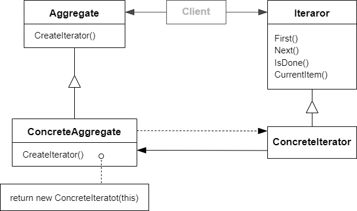

# 迭代器模式 Iterator

注：该模式在 C++ 语言里面过时了，性能上有问题（虚函数）；这里可以对比 STL 中的迭代器，STL 迭代器没有用虚函数的方式

## 动机

在软件构建过程中，集合对象内部结构常常变化各异。但对于这些集合对象，我们希望在不暴露其内部结构的同时，可以让外部客户代码透明地访问其中包含的元素；同时这种“透明遍历”也为“同一种算法在多种集合对象上进行操作”提供了可能

:question: 使用面向对象技术将这种遍历机制抽象为“迭代器对象”为“应对变化中的集合对象”提供了一种优雅的方式

## 模式定义

提供一种方法顺序访问一个聚合对象中的各个元素，而又不暴露（稳定）该对象的内部表示

<div align="center"></div>

## 例子

```cpp
template<typename T>
class Iterator
{
public:
    virtual void first() = 0;
    virtual void next() = 0;
    virtual isDone() const = 0;
    virtual T& current() = 0;
};

template<typename T>
class MyCollection
{
public:
    Iterator<T> GetIterator() {}
};

template<typename T>
class CollectionIterator : public Iterator<T>
{
    MyCollection<T> mc;
public:
    CollectionIterator(const Mycollection<T>& c) : mc(c) {}

    void first() override {}
    void next() override {}
    void isDone() const override {}
    T& current() override {}
};

void MyAlogrithm()
{
    MyCollection<int> mc;
    Iterator<int> iter = mc.GetIterator();

    for (iter.first(); !iter.isDone(); iter.next())
    {
        cout << iter.current() << endl;
    }
}
```

## 要点总结

- 迭代抽象：访问一个聚合对象的内容而无需暴露它的内部表示
- 迭代多态：为遍历不同的集合结构提供一个统一的接口，从而支持同样的算法在不同的集合结构上进行操作
- 迭代器的健壮性考虑：遍历的同时更改迭代器所在的集合结构，会导致问题
