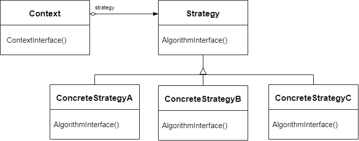

# 策略模式 Strategy

## 动机

在软件构建过程中，某些对象使用的算法可能多种多样，经常改变，如果将这些算法都编码到对象中，将会使对象变得异常复杂；而且有时候支持不使用的算法也是一个性能负担

:question: 如何在运行时根据需要透明地更改对象的算法？将算法与对象本身解耦，从而避免上述问题？

## 模式的定义

策略模式是一种行为设计模式，定义一系列算法，把它们一个个封装起来，并且使用它们可互相替换（变化）。该模式使得算法可独立于使用它的客户程序（稳定）而变化（扩展、子类化）

<div align="center"></div>

## 例子

### 例 1

普通情况下：

```cpp
enum class TaxBase
{
    kCn;
    kUs;
    kDe;
    kFr;  // 新增一个枚举时，对应代码要增加一个if
};

class SalesOrder
{
    TaxBase tax_;
public:
    double CalculateTax()
    {
        if (tax == TaxBase::kCn){ ... }
        else if (tax == TaxBase::kUs) { ... }
        else if (tax == TaxBase::kDe) { ... }
        else if (tax == TaxBase::kFr) { /* 新增部分 */ }
    }
};
```

可以看出

- 每新增一个枚举成员，还需要在程序中新增一个 if 判断句，对该成员进行处理。若成员越来越多，那么判断代码也要变得很多很难维护
- 可考虑使用继承方式，重写基类虚函数即可

改进：

```cpp
class TaxStrategy {
public:
  // Context琛ㄧず璁＄畻闇€瑕佺殑鍙傛暟
  virtual double Calculate(const Context &context) = 0;
  virtual ~TaxStrategy() {}
};

class CNTax : public TaxStrategy {
public:
  virtual double Calculate(const Context &context) {}
};

// 闇€瑕佹墿灞曟椂鍙渶瑕佺户鎵垮熀绫伙紝閲嶅啓铏氬嚱鏁板嵆鍙?class USTax : public TaxStrategy {
public:
  virtual double Calculate(const Context &context) {}
};

class SalesOrder {
private:
  TaxStrategy *strategy_;

public:
  // 可以用工厂模式去创建具体的实现类
  SalesOrder(StrategyFactory *strategyFactory)
      : strateg_(strategyFactory->NewStrategy()) {}
  ~SalesOrder() { delete strategy_; }

  double CalculateTax() {
    Context context();
    double val = strategy_->Calculate(context); }
}
```

### 例 2

```cpp
#include <iostream>
#include <memory>
#include <string>
#include <algorithm>

class Strategy
{
public:
    virtual ~Strategy() = default;
    virtual std::string DoAlgorithm(std::string data) const = 0;
};

class Context
{
private:
    std::unique_ptr<Strategy> strategy_;

public:
    explicit Context(std::unique_ptr<Strategy>&& strategy = {}) :
        strategy_(std::move(strategy)){};

    void SetStrategy(std::unique_ptr<Strategy>&& strategy)
    {
        strategy_ = std::move(strategy);
    }
    void DoSomeBusinessLogic() const
    {
        if (strategy_)
        {
            std::cout << "Context: Sorting data using the strategy (not sure how "
                         "it'll do it)\n";
            std::string result = strategy_->DoAlgorithm("aecbd");
            std::cout << result << "\n";
        }
        else
        {
            std::cout << "Context: Strategy isn't set\n";
        }
    }
};

class ConcreteStrategyA : public Strategy
{
public:
    std::string DoAlgorithm(std::string data) const override
    {
        std::string result(data);
        std::sort(std::begin(result), std::end(result));

        return result;
    }
};
class ConcreteStrategyB : public Strategy
{
    std::string DoAlgorithm(std::string data) const override
    {
        std::string result(data);
        std::sort(std::begin(result), std::end(result), std::greater<>());

        return result;
    }
};

void ClientCode()
{
    Context context(std::make_unique<ConcreteStrategyA>());
    std::cout << "Client: Strategy is set to normaling sorting.\n";
    context.DoSomeBusinessLogic();
    std::cout << "\n";
    std::cout << "Client: Strategy is set to reverse sorting.\n";
    context.SetStrategy(std::make_unique<ConcreteStrategyB>());
    context.DoSomeBusinessLogic();
}

int main(int argc, char* argv[])
{
    ClientCode();
    return 0;
}
```

## 应用场景

- 当你想使用对象中各种不同的算法变体，并希望能在运行时切换算法时，可使用策略模式  
  策略模式让你能够将对象关联至可以不同方式执行特定子任务的不同子对象，从而以间接方式在运行时更改对象行为
- 当你有许多仅在执行某些行为时略有不同的相似类时，可使用策略模式  
  策略模式让你能将不同行为抽取到一个独立类层次结构中，并将原始类组合成同一个，从而减少重复代码
- 如果算法在上下文的逻辑中不是特别重要，使用该模式能将类的业务逻辑与其算法实现细节隔离开来  
  策略模式让你能将各种算法的代码、内部数据和依赖关系与其他代码隔离开来。不同客户端可通过一个简单接口执行算法，并能在运行时进行切换
- 当类中使用了复杂条件运算符以在同一算法的不同变体中切换时，可使用该模式  
  策略模式将所有继承自同样接口的算法抽取到独立类中，因此不再需要条件语句。原始对象并不实现所有算法的变体，而是将执行工作委派给其中的一个独立算法对象

## 优缺点

| <div style="width:150px">优点</div>                                                                                                                                    | 缺点                                                                                                                                                                                                                                                                                                                               |
| ---------------------------------------------------------------------------------------------------------------------------------------------------------------------- | ---------------------------------------------------------------------------------------------------------------------------------------------------------------------------------------------------------------------------------------------------------------------------------------------------------------------------------- |
| 1. 可以在运行时切换对象内的算法 <br> 2. 可以将算法的实现和使用算法的代码隔离开来 <br> 3. 可以使用组合来代替继承 <br> 4. 开闭原则。无需对上下文进行修改就能引入新的策略 | 1. 如果你的算法极少发生改变，那么没有任何理由引入新的类和接口，使用该模式只会让程序过于复杂 <br> 2. 客户端必须知晓策略间的不同-它需要选择合适的策略 <br> 3. 许多现代编程语言支持函数类型功能，允许你在一组匿名函数中实现不同版本的算法。这样，你使用这些函数的方式就和使用策略对象时完全相同，无需借助额外的类和接口来保持代码简洁 |

## 与其他模式的关系

- `桥模式`、`状态模式`和`策略模式`（在某种程度上包括`适配器`）模式的接口非常相似。实际上，它们都基于组合模式——即将工作委派给其他对象，不过也各自解决了不同的问题。模式并不只是以特定方式组织代码的配方，你还可以使用它们来和其他开发者讨论模式所解决的问题
- `命令模式`和`策略模式`看上去很像，因为两者都能通过某些行为来参数化对象。但是，它们的意图有非常大的不同  
  你可以使用命令来将任何操作转换为对象。操作的参数将成为对象的成员变量。你可以通过转换来延迟操作的执行、将操作放入队列、保存历史命令或者向远程服务发送命令等  
  另一方面，策略通常可用于描述完成某件事的不同方式，让你能够在同一个上下文类中切换算法
- `装饰`可让你更改对象的外表，`策略模式`则让你能够改变其本质
- `状态`可被视为`策略`的扩展。两者都基于组合机制：它们都通过将部分工作委派给“帮手”对象来改变其在不同情景下的行为。`策略`使得这些对象相互之间完全独立，它们不知道其他对象的存在。但`状态模式`没有限制具体状态之间的依赖，且允许它们自行改变在不同情景下的状态
- `模板方法模式`基于继承机制：它允许你通过扩展子类中的部分内容来改变部分算法。`策略模式`基于组合机制：你可以通过对相应行为提供不同的策略来改变对象的部分行为。`模板方法`在类层次上运作，因此它是静态的。`策略`在对象层次上运作，因此允许在运行时切换行为

## 总结

- Strategy 及其子类为组件提供了一系列可重用的算法，从而使得类型在运行时方便地根据需要在各个算法之间进行切换
- Strategy 模式提供了用条件判断语句以外的另一种选择，消除条件判断语句，就是在解耦合。含有许多条件判断语句的代码通常都需要 Strategy 模式
- 如果 Strategy 对象没有实例变量，那么各个上下文可以共享一个 Strategy 对象，从而节省对象开销
