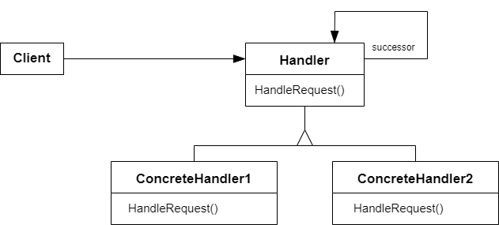

# 职责链模式 Chain Of Responsibility

## 动机

在软件构建过程中，一个请求可能被多个对象处理，但是每个请求在运行时只能有一个接受者，如果显示指定，将必不可少地带来请求发送者与接受者地紧耦合

:question: 如何使请求发送者不需要指定具体的接受者？让请求的接受者自己在运行时决定来处理请求，从而使两者解耦

## 模式定义

职责链模式是一种行为设计模式。允许多个对象都有机会处理请求，从而避免请求的发送者和接收者之间的耦合关系。将这些对象连成一条链，并沿着这条链传递请求，直到有一个对象处理它为止

<div align="center"></div>

## 例子

```cpp
#include <iostream>
#include <string>

using namespace std;

enum class RequestType
{
    kReqHandle1,
    kReqHandle2,
    kReqHandle3
};

class Request
{
private:
    string description_;
    RequestType req_type_;

public:
    Request(const string& desc, RequestType type) :
        description_(desc), req_type_(type) {}
    RequestType GetReqType() const { return req_type_; }
    const string& GetDescription() const { return description_; }
};

class ChainHandler
{
private:
    ChainHandler* next_chain_;
    void SendRequestToNextHandler(const Request& req)
    {
        if (next_chain_ != nullptr)
            next_chain_->Handle(req);
    }

protected:
    virtual bool CanHandleRequest(const Request& req) = 0;
    virtual void ProcessRequest(const Request& req) = 0;

public:
    ChainHandler() :
        next_chain_(nullptr) {}
    void SetNextChain(ChainHandler* next) { next_chain_ = next; }
    void Handle(const Request& req)
    {
        if (CanHandleRequest(req))
            ProcessRequest(req);
        else
            SendRequestToNextHandler(req);
    }
};

class Handler1 : public ChainHandler
{
protected:
    bool CanHandleRequest(const Request& req) override
    {
        return req.GetReqType() == RequestType::kReqHandle1;
    }
    void ProcessRequest(const Request& req) override
    {
        cout << "Handler1 is handle request: " << req.GetDescription() << endl;
    }
};

class Handler2 : public ChainHandler
{
protected:
    bool CanHandleRequest(const Request& req) override
    {
        return req.GetReqType() == RequestType::kReqHandle2;
    }
    void ProcessRequest(const Request& req) override
    {
        cout << "Handler2 is handle request: " << req.GetDescription() << endl;
    }
};

class Handler3 : public ChainHandler
{
protected:
    bool CanHandleRequest(const Request& req) override
    {
        return req.GetReqType() == RequestType::kReqHandle3;
    }
    void ProcessRequest(const Request& req) override
    {
        cout << "Handler3 is handle request: " << req.GetDescription() << endl;
    }
};

int main(int argc, char* argv[])
{
    Handler1 h1;
    Handler2 h2;
    Handler3 h3;
    h1.SetNextChain(&h2);
    h2.SetNextChain(&h3);

    Request req("process task...", RequestType::kReqHandle3);
    h1.Handle(req);
    return 0;
}
```

例 2：

```cpp
#include <iostream>
#include <string>
#include <vector>

class Handler {
public:
  virtual Handler *SetNext(Handler *handler) = 0;
  virtual std::string Handle(std::string request) = 0;
};

class AbstructHandler : public Handler {
private:
  Handler *next_handler_;

public:
  AbstructHandler() : next_handler_(nullptr) {}
  virtual ~AbstructHandler() {}
  Handler *SetNext(Handler *handler) override {
    next_handler_ = handler;
    return handler;
  }
  std::string Handle(std::string request) override {
    if (next_handler_) {
      return next_handler_->Handle(request);
    }
    return {};
  }
};

class MonkeyHandler : public AbstructHandler {
public:
  std::string Handle(std::string request) override {
    if (request == "Banana")
      return "Monkey: I'll eat the " + request + ",\n";
    else
      return AbstructHandler::Handle(request);
  }
};

class SquirreHandler : public AbstructHandler {
public:
  std::string Handle(std::string request) override {
    if (request == "Nut")
      return "Squirrel: I'll eat the " + request + ".\n";
    else
      return AbstructHandler::Handle(request);
  }
};

class DogHandler : public AbstructHandler {
public:
  std::string Handle(std::string request) override {
    if (request == "MeatBall")
      return "Dog: I'll eat the " + request + ".\n";
    else
      return AbstructHandler::Handle(request);
  }
};

void ClientCode(Handler &handler) {
  std::vector<std::string> food = {"Nut", "Banana", "Cup of coffee"};
  for (const std::string &f : food) {
    std::cout << "Client: Who wants a " << f << "?\n";
    const std::string result = handler.Handle(f);
    if (!result.empty())
      std::cout << " " << result;
    else
      std::cout << " " << f << " was left untouched.\n";
  }
}

int main(int argc, char *argv[]) {
  MonkeyHandler *monkey = new MonkeyHandler();
  SquirreHandler *squirrel = new SquirreHandler();
  DogHandler *dog = new DogHandler();
  monkey->SetNext(squirrel)->SetNext(dog);

  std::cout << "Chain: Monkey > Squirrel > Dog\n\n";
  ClientCode(*monkey);
  std::cout << "\n";
  std::cout << "Subchain: Squirrel > Dog\n\n";
  ClientCode(*squirrel);

  delete monkey;
  delete squirrel;
  delete dog;
  return 0;
}
```

## 应用场景

- 当程序需要使用不同方式处理不同种类请求，而且请求类型和顺序预先未知时，可以使用责任链模式  
  该模式能将多个处理者连接成一条链。接收到请求后，它会 “询问” 每个处理者是否能够对其进行处理。这样所有处理者都有机会来处理请求
- 当必须按顺序执行多个处理者时，可以使用该模式  
  无论你以何种顺序将处理者连接成一条链，所有请求都会严格按照顺序通过链上的处理者
- 如果所需处理者及其顺序必须在运行时进行改变，可以使用责任链模式  
  如果在处理者类中有对引用成员变量的设定方法，你将能动态地插入和移除处理者，或者改变其顺序

## 优缺点

| <div style="width:150px">优点</div>                                                                                                                         | 缺点                    |
| ----------------------------------------------------------------------------------------------------------------------------------------------------------- | ----------------------- |
| 1. 你可以控制请求处理的顺序 <br> 2. 单一职责原则。你可以对发起操作和执行操作的类进行解耦 <br> 3. 开闭原则。你可以在不更改现有代码的情况下在程序中新增处理者 | 1. 部分请求可能未被处理 |

## 要点总结

- Chain Of Responsibility 模式的应用场合在于“一个请求可能有多个接受者，但是最后真正的接受者只有一个”，这时候请求发送者与接受者的耦合有可能出现“变化脆弱”的症状，职责链的目的就是将二者解耦，从而更好地应对变化
- 应用了 Chain Of Responsibility 模式后，对象的职责分派将更具灵活性。我们可以在运行时动态添加/修改请求的处理职责
- 如果请求传递到职责链的末尾仍得不到处理，应该有一个合理的缺省机制。这也是每一个接受对象的责任，而不是发出请求对象的责任

## 与其他模式的关系

- `职责链模式`和`装饰器模式`的类结构非常相似。两者都依赖递归组合将需要执行的操作传递给一系列对象。但是，两者有几点重要的不同之处  
  `职责链模式`的管理者可以相互独立地执行一切操作，还可以随时停止传递请求。另一方面，各种`装饰`可以在遵循基本接口的情况下扩展对象的行为。此外，`装饰`无法中断请求的传递
- `职责链模式`通常和`组合模式`结合使用。在这种情况下，叶组件收到请求后，可以将请求沿包含全体父组件的链一直传递至对象树的底部
- `职责链模式`、`命令模式`、`中介者模式`和`观察者模式`用于请求发送者和接收者之间的不同连接方式：
  - `职责链`按照顺序将请求动态地传递给一系列的潜在接收者，直至其中一名接收者对请求进行处理
  - `命令`在发送者和请求者之间建立单向连接
  - `中介者`清除了发送者和请求者之间的直接连接，强制它们通过一个中介对象进行间接沟通
  - `观察者`运行接收者动态地订阅或取消接收请求
- `职责链模式`的管理者可使用`命令模式`实现。在这种情况下，你可以对由请求代表的同一个上下文对象执行许多不同的操作  
  还有另外一种实现方式，那就是请求自身就是一个`命令`对象。在这种情况下，你可以对由一系列不同上下文连接而成的链执行相同的操作
