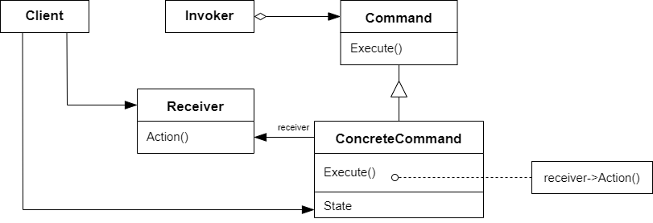

# 命令模式 Command

## 动机

在软件构建过程中，“行为请求者”与“行为实现者”通常呈现一种“紧耦合”。但在某些场合，比如需要对行为进行“记录、撤销/重做、事务”等处理，这种无法抵御变化的紧耦合是不合适的

:question: 在这种情况下，如何将“行为请求者”与“行为实现者”解耦？将一组行为抽象为对象，可以实现二者之间的松耦合

## 模式定义

命令模式是一种行为设计模式。它将一个请求（行为）封装为一个对象，从而使你可用不同的请求对客户进行参数化；对请求排队或记录请求日志，以及支持可撤销操作

<div align="center"></div>

## 例子

### 例 1

```cpp
class Command
{
public:
    virtual void execute() = 0;
};

class ConcreteCommand1 : public Command
{
    string arg;
public:
    ConcreteCommand(const string& a) : arg(s) {}
    void execute() override
    {
        cout << "#1 process ..." << arg <<endl;
    }
};

class ConcreteCommand2 : public Command
{
    string arg;
public:
    ConcreteCommand(const string& a) : arg(s) {}
    void execute() override
    {
        cout << "#1 process ..." << arg <<endl;
    }
};

class ConcreteCommand3 : public Command
{
    string arg;
public:
    ConcreteCommand(const string& a) : arg(s) {}
    void execute() override
    {
        cout << "#1 process ..." << arg <<endl;
    }
};

class MacroCommand : public Command
{
    vector<Command*> commands;
public:
    void addCommand(Command* c) { commands.push_back(c); }
    void execute() override
    {
        for (auto &c : commands)
        {
            c->execute();
        }
    }
};

int main()
{
    ConcreteCommand1 command1(receiver, "Arg ###");
    ConcreteCommand2 command1(receiver, "Arg $$$");

    MacroCommand macro;
    macro.addCommand(&command1);
    macro.addCommand(&command2);

    macro.execute();
}
```

### 例 3

```cpp
#include <iostream>
#include <string>

class Command
{
public:
    virtual ~Command() {}
    virtual void Execute() const = 0;
};

class SimpleCommand : public Command
{
private:
    std::string pay_load_;

public:
    explicit SimpleCommand(std::string pay_load) :
        pay_load_(pay_load) {}
    void Execute() const override
    {
        std::cout << "SimpleCommand: See, I can do simple things link printing (" << pay_load_ << ")\n";
    }
};

class Receiver
{
public:
    void DoSomething(const std::string& a)
    {
        std::cout << "Receiver: Working on (" << a << ".)\n";
    }
    void DoSomethingElse(const std::string& b)
    {
        std::cout << "Receiver: Also working on (" << b << ".)\n";
    }
};

class ComplexCommand : public Command
{
private:
    Receiver* receiver_;
    std::string a_;
    std::string b_;

public:
    ComplexCommand(Receiver* receiver, std::string a, std::string b) :
        receiver_(receiver), a_(a), b_(b) {}

    void Execute() const override
    {
        std::cout << "ComplexCommand: Complex stuff should be done by a receiver object.\n";
        receiver_->DoSomething(a_);
        receiver_->DoSomethingElse(b_);
    }
};

class Invoker
{
private:
    Command* on_start_;
    Command* on_finish_;

public:
    ~Invoker()
    {
        delete on_start_;
        delete on_finish_;
    }

    void SetOnStart(Command* command)
    {
        on_start_ = command;
    }
    void SetOnFinish(Command* command)
    {
        on_finish_ = command;
    }
    void DoSomethingImportant()
    {
        std::cout << "Invoker: Does anybody want something done before I begin?\n";
        if (on_start_)
            on_start_->Execute();
        std::cout << "Invoker: ...doing something really important...\n";
        std::cout << "Invoker: Does anybody want something done after I finish?\n";
        if (on_finish_)
            on_finish_->Execute();
    }
};

int main(int argc, char* argv[])
{
    Invoker* invoker = new Invoker;
    invoker->SetOnStart(new SimpleCommand("Say Hi"));
    Receiver* receiver = new Receiver;
    invoker->SetOnFinish(new ComplexCommand(receiver, "Send email", "Save report"));
    invoker->DoSomethingImportant();

    delete invoker;
    delete receiver;
    return 0;
}
```

## 应用场景

- 如果你需要通过操作来参数化对象，可使用命令模式  
  命令模式可将特定的方法调用转化为独立对象。这一改变也带来了许多有趣的应用：你可以将命令作为方法的参数进行传递、将命令保存在其他对象中，或者在运行时切换已连接的命令等
- 如果你想要将操作放入队列中、操作的执行或者远程执行操作，可使用命令模式  
  同其他对象一样，命令也可以实现序列化（序列化的意思是转化为字符串），从而能方便地写入文件或数据库中。一段时间后，该字符串可被恢复成为最初的命令对象。因此，你可以延迟或计划命令的执行。但其功能远不止如此！使用同样的方式，你还可以将命令放入队列、记录命令或者通过网络发送命令。
- 如果你想要实现操作回滚功能，可使用命令模式  
  尽管有很多方法可以实现撤销和恢复功能，但命令模式可能是其中最常用的一种
  为了能够回滚操作，你需要实现已执行操作的历史记录功能。命令历史记录是一种包含所有已执行命令对象及其相关程序状态备份的栈结构  
  这种方法有两个缺点。首先，程序状态的保存功能并不容易实现，因为部分状态可能是私有的。你可以使用备忘录模式来在一定程度上解决这个问题  
  其次，备份状态可能会占用大量内存。因此，有时你需要借助另一种实现方式：命令无需恢复原始状态，而是执行反向操作。反向操作也有代价：它可能会很难甚至是无法实现

## 优缺点

| <div style="width:150px">优点</div>                                                                                                                                                                                           | 缺点                                                                      |
| ----------------------------------------------------------------------------------------------------------------------------------------------------------------------------------------------------------------------------- | ------------------------------------------------------------------------- |
| 1. 单一职责原则。可以解耦触发和执行的操作类 <br> 2. 开闭原则。可以在不修改已有客户端代码的情况下在程序中创建新命令 <br> 3. 可以实现撤销和恢复功能 <br> 4. 可以实现操作的延迟执行 <br> 5. 可以将一组简单命令组合成一个复杂命令 | 1. 代码可能会变得更加复杂，因为你在发送者和接收者之间增加了一个全新的层次 |

## 要点总结

- Command 模式的根本目的在于将“行为请求者”与“行为实现者”解耦，在面向对象语言中，常见的实现手段是“将行为抽象为对象”
- 实现 Command 接口的具体命令对象 ConcreteCommnad 有时候根据需要可能会保存一些额外的状态信息，通过使用 Composite 模式，可以将多个“命令”封装为一个“复合命令”MacroCommand
- Command 模式与 C++中的函数对象有些类似。但两者定义行为接口规范有所区别：Command 以面向对象中“接口-实现”来定义行为接口规范，更严格，但有性能损失；C++函数对象以函数签名来定义行为接口规范，更灵活，性能更高。（C++该模式用的少是因为 C++有函数对象）

## 与其他模式的关系

- `职责链模式`、`命令模式`、`中介者模式`和`观察者模式`用于请求发送者和接收者之间的不同连接方式：
  - `职责链`按照顺序将请求动态地传递给一系列的潜在接收者，直至其中一名接收者对请求进行处理
  - `命令`在发送者和请求者之间建立单向连接
  - `中介者`清除了发送者和请求者之间的直接连接，强制它们通过一个中介对象进行间接沟通
  - `观察者`运行接收者动态地订阅或取消接收请求
- `职责链模式`的管理者可使用`命令模式`实现。在这种情况下，你可以对由请求代表的同一个上下文对象执行许多不同的操作  
  还有另外一种实现方式，那就是请求自身就是一个`命令`对象。在这种情况下，你可以对由一系列不同上下文连接而成的链执行相同的操作
- 你可以同时使用`命令模式`和`备忘录模式`来实现 “撤销”。在这种情况下，`命令`用于对目标对象执行各种不同的操作，`备忘录`用来保存一条命令执行前该对象的状态
- `原型`可用于保存`命令模式`的历史记录
- 可以将`访问者模式`视为`命令模式`的加强版本，其对象可对不同类的多种对象执行操作
- `命令模式`和`策略模式`看上去很像，因为两者都能通过某些行为来参数化对象。但是，它们的意图有非常大的不同  
  你可以使用命令来将任何操作转换为对象。操作的参数将成为对象的成员变量。你可以通过转换来延迟操作的执行、将操作放入队列、保存历史命令或者向远程服务发送命令等  
  另一方面，策略通常可用于描述完成某件事的不同方式，让你能够在同一个上下文类中切换算法
