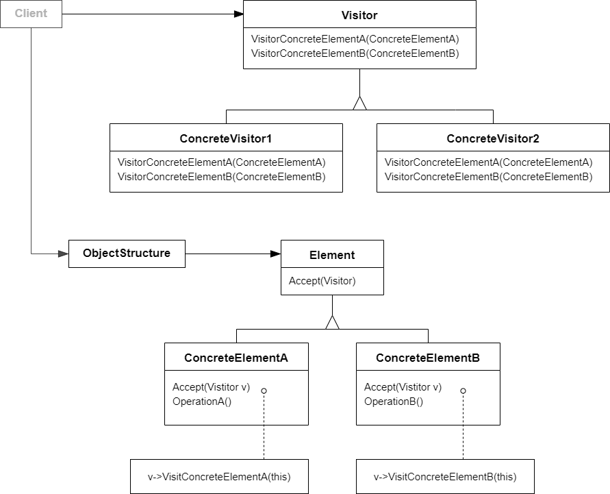

# 访问器模式 Visitor

## 动机

在软件构建过程中，由于需求的改变，某些类层次结构中常常需要增加新的行为（方法），如果直接在基类中做这样的更改，将会给子类带来很繁重的变更负担，甚至破坏原有设计

:question: 如何在不更改类层次结构的前提下，在运行时根据需要透明地为类层次结构上的各个类动态添加新的操作，从而避免上述问题？

## 模式定义

表示一个作用于某对象结构的各元素的操作。使得可以在不改变（稳定）各元素的类的前提下定义（扩展）作用于这些元素的新操作（变化）

<div align="center"></div>

## 例子

```cpp
class Element
{
public:
    virtual void Func1() = 0;
    virtual ~Element() {}
};

class ElementA : public Element
{
public:
    void Func1() override {}
};

class ElementB : public Element
{
public:
    void Func1() override {}
};
```

若现在要添加一个新的接口，可能会在基类添加一个 Func2()，然后所有子类都要重写 Func2()......

```cpp
class Visitor;

class Element
{
public:
    virtual void accept(Visitor& visitor) = 0; // 第一次多态辨析
    virtual ~Element() {}
};

class ElementA : public Element
{
public:
    void accept(Visitor& visitor) override
    {
        visitor.visitElementA(*this);
    }
};

class ElementB : public Element
{
public:
    void accept(Visitor& visitor) override
    {
        visitor.visitElementB(*this);
    }
};

class Visitor
{
public:
    virtual void visitElementA(ElementA& element) = 0;
    virtual void visitElementB(ElementB& element) = 0;

    virtual ~Visitor() {}
};

// 以上代码结构都已经设计好了
// 现在要进行扩展，扩展代码如下

// 扩展1
class Visitor1 : public Visitor
{
public:
    void visitElementA(ElementA& element) override
    {
        cout << "Visitor is processing ElementA" << endl;
    }
    void visitElementB(ElementB& element) override
    {
        cout << "Visitor is processing ElementB" << endl;
    }
};

// 扩展2
class Visitor2 : public Visitor
{
public:
    void visitElementA(ElementA& element) override
    {
        cout << "Visitor is processing ElementA" << endl;
    }
    void visitElementB(ElementB& element) override
    {
        cout << "Visitor is processing ElementB" << endl;
    }
};

// 使用
int main()
{
    Visitor2 visitor;
    ElementB elementB;
    elementB.accept(visitor);   // double patch

    ElementA elementA;
    elementA.accept(visitor);

    return 0;
}
```

## 要点总结

- Visitor 模式通过所谓双重分发（double dispatch）来实现现在不更改（不添加新的操作-编译时）Element 类层次结构的前提下，在运行时透明地为类层次结构上的各个动态添加新的操作（支持变化）
- 所谓双重分发即 Visitor 模式中间包括了两个多态分发（注意其中的多态机制）：第一个为 accept 方法的多态辨析；第二个为 visitElementX 方法的多态辨析
- Visitor 模式最大的缺点在于扩展类层次结构（增添新的 Element 子类），会导致 Visitor 类的改变。因此 Visitor 模式适用于“Element 类层次结构稳定，而其中的操作却经常面临频繁改动”（Element 子类个数必须稳定，这样才能使得 Visitor 支持变化，因为 Visitor 必须支持所有 Element 子类）
