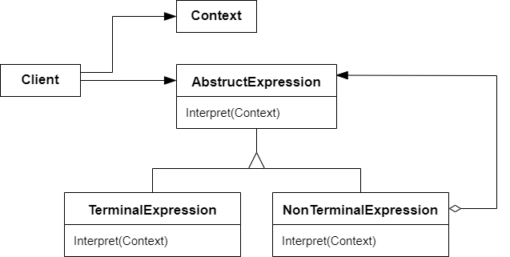

# 解析器 Interpreter

## 动机

在软件构建过程中，如果某一特定领域的问题比较复杂，类似的结构不断重复出现，如果使用普通的编程方式来实现将面临非常频繁的变化

:question: 在这种情况下，将特定领域的问题表达为某种语法规则下的局子，然后构建一个解释器来解释这样的句子，从而达到解决问题的目的

## 模式定义

给定一个语言，定义它的文法的一种表示，并定义一种解释器，这个解释器使用该表示来解释语言中的句子

<div align="center"></div>

## 例子

```cpp
class Expression
{
public:
    virtual int Interpreter(map<char, int> var) = 0;
    virtual ~Expression() {}
};

//变量表达式
class VarExpression : public Expression
{
    char key_;

public:
    VarExpression(const char& key) { key_ = key; }

    int Interpreter(map<char, int> var) override { return var[key_]; }
};

//符号表达式
class SymbolExpression : public Expression
{
    // 运算符左右两个参数
protected:
    Expression* left_;
    Expression* right_;

public:
    SymbolExpression(Expression* left, Expression* right) :
        left_(left), right_(right) {}
};

//加法运算
class AddExpression : public SymbolExpression
{
public:
    AddExpression(Expression* left, Expression* right) :
        SymbolExpression(left, right) {}
    int Interpreter(map<char, int> var) override
    {
        return left->Interpreter(var) + right->Interpreter(var);
    }
};

//减法运算
class SubExpression : public SymbolExpression
{
public:
    SubExpression(Expression* left, Expression* right) :
        SymbolExpression(left, right) {}
    int Interpreter(map<char, int> var) override
    {
        return left_->Interpreter(var) - right_->Interpreter(var);
    }
};

Expression* Analyse(string expStr)
{
    stack<Expression*> expStack;
    Expression* left = nullptr;
    Expression* right = nullptr;
    for (int i = 0; i < expStr.size(); i++)
    {
        switch (expStr[i])
        {
        case '+':
            // 加法运算
            left = expStack.top();
            right = new VarExpression(expStr[++i]);
            expStack.push(new AddExpression(left, right));
            break;
        case '-':
            // 减法运算
            left = expStack.top();
            right = new VarExpression(expStr[++i]);
            expStack.push(new SubExpression(left, right));
            break;
        default:
            // 变量表达式
            expStack.push(new VarExpression(expStr[i]));
        }
    }

    Expression* expression = expStack.top();

    return expression;
}

void Release(Expression* expression)
{
    //释放表达式树的节点内存...
}

// 应用
int main(int argc, const char* argv[])
{
    string expStr = "a+b-c+d-e";
    map<char, int> var;
    var.insert(make_pair('a', 5));
    var.insert(make_pair('b', 2));
    var.insert(make_pair('c', 1));
    var.insert(make_pair('d', 6));
    var.insert(make_pair('e', 10));

    Expression* expression = Analyse(expStr);

    int result = expression->Interpreter(var);

    cout << result << endl;

    Release(expression);

    return 0;
}
```

## 要点总结

- Interpreter 模式的应用场合是 Interpreter 模式应用中的难点，只有满足“业务规则频繁变化，且类似的结构不断重复出现，并且容易抽象为语法规则的问题”才适合使用 Interpreter
- 使用 Interpreter 模式来表示文法规则，从而可以使用面向对象技巧来方便地“扩展”文法
- Interpreter 模式比较适合简单的文法表示，对于复杂的文法表示，Interpreter 模式会产生比较大的类层次结构，需要求助语法分析生成器这样的标准工具
