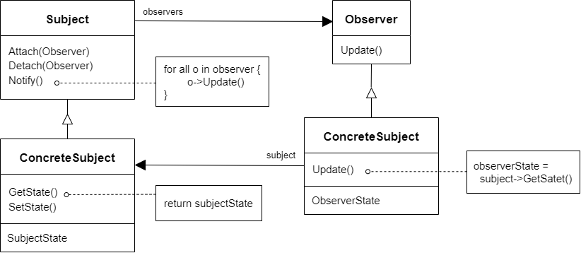

# 观察者模式 Observer

## 动机

在软件构建过程中，我们需要为某些对象建立一种“通知依赖关系”--一个对象（目标对象）的状态发生改变，所有的依赖对象（观察者对象）都将得到通知。如果这样的依赖关系过于紧密，将使软件不能很好地抵御变化

:question: 使用面对对象技术，可以将这种依赖关系弱化，并形成一种稳定的依赖关系。从而实现软件体系结构的松耦合

## 模式定义

观察者模式是一种行为设计模式，允许你定义一种订阅机制，可在对象事件发生时通知多个“观察”该对象的其他对象

定义对象间的一种一对多（变化）的依赖关系，以便当一个对象的状态发生改变时，所有依赖于它的对象都得到通知并更新

<div align="center"></div>

## 例子

### 例 1

需求：做一个文件分割器

```cpp
// 操作界面  MainForm.cpp
class MainForm
{
private:
    TextBox* txt_file_path_;     // 文件路径
    int txt_file_number_;   // 文件分割个数

public:
    void Button1Click()
    {
        string file_path = txt_file_path_->GetPath();
        int number = txt_file_number;

        FileSplitter splitter(file_path, number);
        splitter.Split();
    }
};

// 文件分割 FiltterSplitter
class FilterSplitter
{
    string file_path_;
    int file_number_;

public:
    FilterSplitter(const string& filepath, int filenumber):
    file_path_(filepath), file_number_(filenumber) {}

    void split()
    {
        // 1. 读取大文件

        // 2. 分批次向小文件中写入
        for (int i = 0; i < file_number_; ++i)
        { // ...
        }
    }
};
```

需求增加：需要一个进度条，查看分割进展

增加一个进度条的操作对象

```cpp
// 操作界面  MainForm.cpp
class MainForm
{
    TextBox* txt_file_path_;     // 文件路径
    int txt_file_number_;   // 文件分割个数

    ProgressBar* progress_bar_;  // 进度条

public:
    void Button1Click()
    {
        string filepath = txt_file_path_->GetPath();
        int number = txt_file_number;

        FileSplitter splitter(filepath, number, progress_bar_);
        splitter.Split();
    }
};

// 文件分割 FiltterSplitter
class FilterSplitter
{
    string file_path_;
    int file_number_;
    ProgressBar* progress_bar_;

public:
    FilterSplitter(const string& filepath, int filenumber, ProgressBar* progressbar):
    file_path_(filepath), file_number_(filenumber), progress_bar_(progressbar) {}

    void split()
    {
        // 1. 读取大文件

        // 2. 分批次向小文件中写入
        for (int i = 0; i < file_number_; ++i)
        { // ...

            // 更新进度条内容
            if (progress_bar_ != nullptr)
                progress_bar_->SetValue((i+1)/file_number_);
        }
    }
};
```

可见上述代码中，FilterSplitter 中的 ProgressBar 违反了八大设计原则中的第一点。现在就需要把 ProgressBar 抽象出来。

```cpp
// 抽象基类 IProgress
class IProgress
{
public:
    virtual void DoProgress(float value) = 0;
    ~virtual ~IProgress(){}
};

// 所以FilterSplitter替换抽象控件
class FilterSplitter
{
    string file_path_;
    int file_number_;

    // ProgressBar* m_progressBar; 具体通知控件
    IProgress* m_iprogress;     // 抽象通知空间

public:
    FilterSplitter(const string& filepath, int filenumber, IProgress* progress):
    file_path_(filepath), file_number_(filenumber), m_iprogress(progress) {}

    void split()
    {
        // 1. 读取大文件

        // 2. 分批次向小文件中写入
        for (int i = 0; i < file_number_; ++i)
        { // ...

            // 更新进度条内容
            float progressValue = file_number_;
            progressValue = (i + 1) / progressValue;
            onProgress(progressValue);
        }
    }

protected:
    void onProgress(float value)
    {
        if (m_iprogress != nullptr)
            m_progressBar->DoProgress((i+1)/file_number_);
    }
};

// 同理，MainForm也可以解耦
// MainForm本身就是具体的实现，继承IProgress是可以的
class MainForm : public IProgress
{
    TextBox* txt_file_path_;   // 文件路径
    int txtFileNumber;      // 文件分割个数

    IProgress* progressBar;  // 进度条

public:
    void Button1_Click()
    {
        string filePath = txtFielPath->getPath();
        int number = txtFileNumber;

        FileSplitter splitter(filePath, number, this);
        splitter.split();
    }

    virtual void DoProgress(float value)
    {
        progressBar->setValue(value);
    }
};

```

又一新需求，假设有多个观察者，那么可用一个 List（或其他容器）将观察者装入

```cpp
// 抽象基类 IProgress
class IProgress
{
public:
    virtual void DoProgress(float value) = 0;
    ~virtual ~IProgress(){}
};

class FilterSplitter
{
    string file_path_;
    int file_number_;

    // IProgress* m_iprogress;     // 抽象通知空间
    List<IProgress*> iprogress_list_;  // 用vector存多个观察者

public:
    // 构造函数也变了
    FilterSplitter(const string& filepath, int filenumber):
    file_path_(filepath), file_number_(filenumber) {}

    // 添加一个观察对象
    void AddIProgress(IProgress* iprogress)
    {
        iprogress_list_.push_back(iprogress);
    }

    // 移除一个观察者
    void RemoveIProgress(IProgress* iprogress)
    {
        iprogress_list_.remove(iprogress);
    }

    void Split()
    {
        // 1. 读取大文件

        // 2. 分批次向小文件中写入
        for (int i = 0; i < file_number_; ++i)
        { // ...

            // 更新进度条内容
            float progressValue = file_number_;
            progressValue = (i + 1) / progressValue;
            OnProgress(progressValue);
        }
    }

protected:
    void OnProgress(float value)
    {
        for ( auto iter : iprogress_list_)
            iter->DoProgress( (i + 1) / file_number_);
    }
};

// 同理，MainForm也可以解耦
// MainForm本身就是具体的实现，继承IProgress是可以的
class MainForm : public IProgress
{
    TextBox* txt_file_path_;   // 文件路径
    int txt_file_number_;      // 文件分割个数

    IProgress* progress_bar_;  // 进度条

public:
    void Button1Click()
    {
        string filepath = txt_file_path_->GetPath();
        int number = txt_file_number_;

        ConsoleNofifier cn;
        FileSplitter Splitter(filepath, number);

        splitter.AddIProgress(this);
        splitter.AddIProgress(&cn);
        spliter.Split();
    }

    virtual void DoProgress(float value)
    {
        progress_bar_->SetValue(value);
    }
};

// 新的观察者对象
class ConsoleNotifier : public IProgress
{
    virtual void DoProgress(float value)
    {}
};
```

### 例 2

```cpp
#include <iostream>
#include <list>
#include <string>

class IObserver
{
public:
    virtual ~IObserver(){};

    virtual void Update(const std::string& message_from_subject) = 0;
};

class ISubject
{
public:
    virtual ~ISubject(){};

    virtual void Attach(IObserver* observer) = 0;
    virtual void Detach(IObserver* observer) = 0;
    virtual void Notify() = 0;
};

class Subject : ISubject
{
private:
    std::list<IObserver*> list_observer_;
    std::string message_;

public:
    virtual ~Subject()
    {
        std::cout << "Goodbye, I was the Subject.\n";
    }

    void Attach(IObserver* observer) override
    {
        list_observer_.push_back(observer);
    }
    void Detach(IObserver* observer) override
    {
        list_observer_.remove(observer);
    }
    void Notify() override
    {
        HowManyObserver();
        for (auto observer : list_observer_)
            observer->Update(message_);
    }

    void HowManyObserver()
    {
        std::cout << "There are " << list_observer_.size() << " observers in the list.\n";
    }
    void CreateMessage(std::string message = "Empty")
    {
        message_ = message;
        Notify();
    }
    void SomeBussinessLogic()
    {
        message_ = "change message message";
        Notify();
        std::cout << "I'm about to do some thing important!\n";
    }
};

class Observer : public IObserver
{
private:
    std::string message_from_subject_;
    Subject& subject_;
    int number_;
    static int static_number_;

public:
    Observer(Subject& subject) :
        subject_(subject)
    {
        subject_.Attach(this);
        std::cout << "Hi, I'm the Observer \"" << ++Observer::static_number_ << "\".\n";
        number_ = Observer::static_number_;
    }
    virtual ~Observer()
    {
        std::cout << "Goodbye, I was the Observer \"" << this->number_ << "\".\n";
    }

    void Update(const std::string& message_from_subject) override
    {
        message_from_subject_ = message_from_subject;
        std::cout << "Observer \"" << number_ << "\": a new message is available --> " << message_from_subject_ << "\n";
    }
    void RemoveMeFromTheList()
    {
        subject_.Detach(this);
        std::cout << "Observer \"" << number_ << "\" removed from the list.\n";
    }
};

int Observer::static_number_ = 0;

void ClientCode()
{
    Subject* subject = new Subject;
    Observer* observer1 = new Observer(*subject);
    Observer* observer2 = new Observer(*subject);
    Observer* observer3 = new Observer(*subject);
    Observer* observer4;
    Observer* observer5;

    subject->CreateMessage("Hello World! :D");
    observer3->RemoveMeFromTheList();

    subject->CreateMessage("The Weather is hot today! :p");
    observer4 = new Observer(*subject);

    observer2->RemoveMeFromTheList();
    observer5 = new Observer(*subject);

    subject->CreateMessage("My new car is great! ;)");
    observer5->RemoveMeFromTheList();

    observer4->RemoveMeFromTheList();
    observer1->RemoveMeFromTheList();

    delete observer5;
    delete observer4;
    delete observer3;
    delete observer2;
    delete observer1;
    delete subject;
}

int main(int argc, char* argv[])
{
    ClientCode();
    return 0;
}
```

## 应用场景

- 当一个对象状态的改变需要改变其他对象，或实际对象是事先未知的或动态变化的时，可使用观察者模式  
  当你使用图形用户界面类时通常会遇到一个问题。比如，你创建了自定义按钮类并允许客户端在按钮中注入自定义代码，这样当用户按下按钮时就会触发这些代码  
  观察者模式允许任何实现了订阅者接口的对象订阅发布者对象的事件通知。你可在按钮中添加订阅机制，允许客户端通过自定义订阅类注入自定义代码
- 当应用中的一些对象必须观察其他对象时，可使用该模式。但仅能在有限时间内或特定情况下使用  
  订阅列表是动态的，因此订阅者可随时加入或离开该列表

## 优缺点

| <div style="width:40%">优点</div>                                                                                            | 缺点                        |
| ---------------------------------------------------------------------------------------------------------------------------- | --------------------------- |
| 1. 开闭原则。无需修改发布者代码就能引入新的订阅类（如果是发布者接口则轻松引入发布类） <br> 2. 可以在运行时建立对象之间的联系 | 1. 订阅者的通知顺序是随机的 |

## 要点总结

- 使用面对对象的抽象，Observer 模式使得我们可以独立地改变目标与观察者，从而使二者之间地依赖关系达致松耦合
- 目标发送通知时，无需指定观察者，通知（可以携带通知信息作为参数）自动传播
- 观察者自己决定是否需要订阅通知，目标对象对此一无所知
- Observer 模式是基于事件的 UI 框架中非常常用的设计模式，也是 MVC 模式的一个重要组成部分

## 与其他模式的关系

- `职责链模式`、`命令模式`、`中介者模式`和`观察者模式`用于请求发送者和接收者之间的不同连接方式：
  - `职责链`按照顺序将请求动态地传递给一系列的潜在接收者，直至其中一名接收者对请求进行处理
  - `命令`在发送者和请求者之间建立单向连接
  - `中介者`清除了发送者和请求者之间的直接连接，强制它们通过一个中介对象进行间接沟通
  - `观察者`运行接收者动态地订阅或取消接收请求
- `中介者`和`观察者`之间的区别往往很难记住。在大部分情况下，你可以使用其中一种模式，而有时可以同时使用。让我们来看看如何做到这一点  
  `中介者`的主要目标是消除一系列系统组件之间的相互依赖。这些组件将依赖于同一个中介者对象。`观察者`的目标是在对象之间建立动态的单向连接，使得部分对象可作为其他对象的附属发挥作用  
  有一种流行的`中介者模式`实现方式依赖于`观察者`。中介者对象担当发布者的角色，其他组件则作为订阅者，可以订阅中介者的事件或取消订阅。当中介者以这种方式实现时，它可能看上去与观察者非常相似  
  当你感到疑惑时，记住可以采用其他方式来实现中介者。例如，你可永久性地将所有组件链接到同一个中介者对象。这种实现方式和观察者并不相同，但这仍是一种中介者模式  
  假设有一个程序，其所有的组件都变成了发布者，它们之间可以相互建立动态连接。这样程序中就没有中心化的中介者对象，而只有一些分布式的观察者
