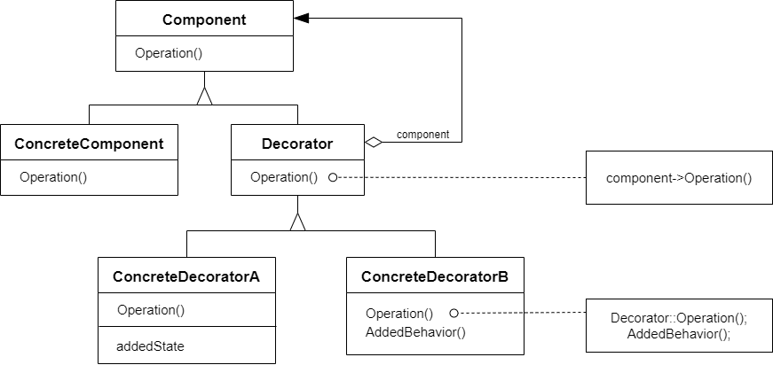

# 装饰器模式 Decorator

## 动机

在我们情况我们可能会“过度地使用继承来扩展对象的功能”，由于继承为类型引入的静态特质，使得这种扩展方式缺乏灵活性；并且随着子类的增多（扩展功能的增多），各种子类的组合（扩展功能的组合）会导致更多子类的膨胀

:question: 如何使“对象功能的扩展”能够根据需要来动态地实现？同时避免“扩展功能的增多”带来的子类膨胀问题？从而使得任何“功能扩展变化”所导致的影响降为最低？

## 模式定义

装饰器模式是一种结构型设计模式，允许你通过将对象放入包含行为的特殊封装对象中来为原对象绑定新的行为

动态（组合）地给一个对象增加额外地职责。就增加功能而言，Decorator 模式比生成子类（继承）更为灵活（消除重复代码&减少子类个数）

<div align="center"></div>

## 例子

### 例 1

需求：流操作，比如 IO 流，文件流，网络流等，有时候还需要对特定的流进行加密操作

```cpp
// 基类
class Stream
{
public:
    virtual char Read(int number) = 0;
    virtual void Seek(int position) = 0;
    virtual void Write(char data) = 0;

    virtual ~Stream() = 0;
};

// 文件流
class FileStream: public Stream
{
public:
    virtual char Read(int number) {}
    virtual void Seek(int position) {}
    virtual void Write(char data) {}
};

// 网络流
class NetworkStram: public Stream
{
public:
    virtual char Read(int number) {}
    virtual void Seek(int position) {}
    virtual void Write(char data) {}
};

// 内存流
class MemoryStream: public Stream
{
public:
    virtual char Read(int number) { }
    virtual void Seek(int position) { }
    virtual void Write(char data) { }
};


// 现在要对文件流、网络流、内存流进行加密操作
class CryptoFileStream: public FileStream
{
public:
    virtual char Read(int number)
    {
        // 额外加密操作
        // ...
        FileStream::Read(number); // 读文件流
    }
    virtual void Seek(int position)
    {
        // 额外加密操作
        // ...
        FileStream::Seek(position);
        // 额外加密操作
        // ...
    }
    virtual void Write(char data)
    {
        // 额外加密操作
        // ...
        FileStream::Write(position);
        // 额外加密操作
        // ...
    }
};
class CryptoNetworkStream: public NetworkStream
{
public:
    virtual char Read(int number)
    {
        // 额外加密操作
        // ...
        NetworkStream::Read(number); // 读文件流
    }
    virtual void Seek(int position)
    {
        // 额外加密操作
        // ...
        NetworkStream::Seek(position);
        // 额外加密操作
        // ...
    }
    virtual void Write(char data)
    {
        // 额外加密操作
        // ...
        NetworkStream::Write(position);
        // 额外加密操作
        // ...
    }
};
class CryptoMemoryStream: public MemoryStream
{
public:
    virtual char Read(int number)
    {
        // 额外加密操作
        // ...
        MemoryStream::Read(number); // 读文件流
    }
    virtual void Seek(int position)
    {
        // 额外加密操作
        // ...
        MemoryStream::Seek(position);
        // 额外加密操作
        // ...
    }
    virtual void Write(char data)
    {
        // 额外加密操作
        // ...
        MemoryStream::Write(position);
        // 额外加密操作
        // ...
    }
};
```

### 例 2

```cpp
#include <string>
#include <iostream>

class Component
{
public:
    virtual ~Component() {}
    virtual std::string Operation() const = 0;
};

class ConcreteComponent : public Component
{
public:
    std::string Operation() const override
    {
        return "ConcreteComponent";
    }
};

class Decorator : public Component
{
protected:
    Component* component_;

public:
    Decorator(Component* component) :
        component_(component) {}
    std::string Operation() const override
    {
        return component_->Operation();
    }
};

class ConcreteDecoratorA : public Decorator
{
public:
    ConcreteDecoratorA(Component* component) :
        Decorator(component) {}
    std::string Operation() const override
    {
        return "ConcreteDecoratorA(" + Decorator::Operation() + ")";
    }
};

class ConcreteDecoratorB : public Decorator
{
public:
    ConcreteDecoratorB(Component* component) :
        Decorator(component) {}
    std::string Operation() const override
    {
        return "ConcreteDecoratorB(" + Decorator::Operation() + ")";
    }
};

void ClientCode(Component* component)
{
    std::cout << "Result: " << component->Operation();
}

int main(int argc, char* argv[])
{
    Component* simple = new ConcreteComponent;
    std::cout << "Client: I've got a simple component:\n";
    ClientCode(simple);
    std::cout << "\n\n";

    Component* decorator1 = new ConcreteDecoratorA(simple);
    Component* decorator2 = new ConcreteDecoratorB(decorator1);
    std::cout << "Client: Now I've got a decorated component:\n";
    ClientCode(decorator2);
    std::cout << "\n";

    delete simple;
    delete decorator1;
    delete decorator2;
    return 0;
}
```

## 应用场景

- 如果你希望在无需修改代码的情况下即可使用对象，且希望在运行时为对象新增额外的行为，可以使用装饰模式  
  装饰能将业务逻辑组织为层次结构，你可为各层创建一个装饰，在运行时将各种不同逻辑组合成对象。由于这些对象都遵循通用借口，客户端代码能以相同的方式使用这些对象
- 如果用继承来扩展对象行为的方案难以实现或者根本不可行，可以使用该模式  
  许多编程语言使用 final 关键字来限制对某个类的进一步扩展。复用最终类已有行为的唯一方法就是使用装饰模式：用封装器对其进行封装

## 优缺点

| <div style="width:100px">优点</div>                                                                                                                                                                          | 缺点                                                                                                                                |
| ------------------------------------------------------------------------------------------------------------------------------------------------------------------------------------------------------------ | ----------------------------------------------------------------------------------------------------------------------------------- |
| 1. 你无需创建新子类即可扩展对象的行为 <br> 2. 你可以在运行时添加或删除对象的功能 <br> 3. 你可以用多个装饰封装对象来组合几种行为 <br> 4. 单一职责原则。你可以将实现了许多不同行为的一个大类拆分为多个较小的类 | 1. 在封装器中删除特定封装器比较困难 <br> 2. 实现行为不受装饰栈顺序影响的装饰比较困难 <br> 3. 各层的初始化配置代码看上去可能会很糟糕 |

## 与其他模式的关系

- `适配器模式`可以对已有对象的接口进行修改，`装饰器模式`则能在不改变接口对象的前提下强化对象功能。此外，`装饰`还支持组合递归，`适配器`则无法实现
- `适配器模式`能为被封装对象提供不同的接口，`代理模式`能为对象提供相同的接口，`装饰器模式`则能为对象提供加强的接口
- `职责链模式`和`装饰器模式`的类结构非常相似。两者都依赖递归组合将需要执行的操作传递给一系列对象。但是，两者有几点重要的不同之处  
  `职责链模式`的管理者可以相互独立地执行一切操作，还可以随时停止传递请求。另一方面，各种`装饰`可以在遵循基本接口的情况下扩展对象的行为。此外，`装饰`无法中断请求的传递
- `组合模式`和`装饰器模式`结构图很相似，因为两者都依赖递归组合来组织无限数量的对象  
  装饰类似于组合，但其只有一个子组件。此外还有一个明显不同：装饰为被封装对象添加了额外的职责，组合仅对于其子节点的结果进行了“求和”  
  但是模式也可以相互合作：你可以用装饰来扩展组合树中特定对象的行为
- 大量使用`组合`和`装饰`的设计通常可从对于`原型模式`的使用中获益。你可以通过该模式来复制复杂结构，而非从零开始重新构造
- `装饰`可让你更改对象的外表，`策略模式`则让你能够改变其本质
- `装饰`和`代理`有着相似的结构，但是其意图却非常不同。这两个模式的构建都是基于组合原则，也就是说一个对象应该将部分工作委派给另一个对象。两者之间的不同之处在于`代理`通常自行管理其服务对象的生命周期，而`装饰`的生成则总是由客户端进行控制

## 要点总结

- 通过采用组合而非继承的手法，Decorator 模式实现了在运行时动态扩展对象功能的能力，而且可以根据需要扩展多个功能。避免了使用继承带来的“灵活性差”和“多子类衍生问题”
- Decorator 类在接口上表现为 is-a Component 的继承关系，即 Decorator 类继承了 Component 类所具有的接口。但在实现上又表现为 has-a Component 的组合关系，即 Decorator 类又使用了另外一个 Component 类
- Decorator 模式的目的并非解决“多子类衍生的多继承”问题，Decorator 模式应用的要点在于解决“主体类在多个方向上的扩展功能” -- 是为“装饰”的含义
