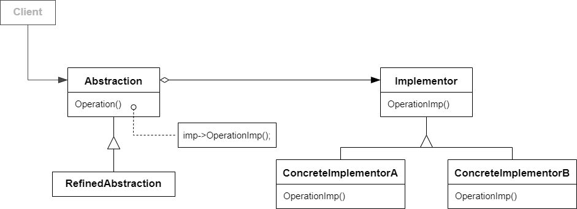

# Bridge 桥模式

## 动机

由于某些类型的固有的实现逻辑，使得它们具有两个变化的维度，乃至多个维度的变化

:question: 如果应对这种“多维度的变化”？如何利用面向对象技术来使得类型可以轻松地沿着两个乃至多个方向变化，而不引入额外地复杂度

## 模式定义

桥模式是一种结构型设计模式，可将一个大类或一系列紧密相关的类拆分为抽象和实现两个独立的层次结构，从而能在开发时分别使用，即将抽象部分（业务功能）与实现部分（平台实现）分离，使它们都可以独立地变化

<div align="center"></div>

## 例子

### 例 1

```cpp
class Messager
{
public:
    virtual ~Messager() {}

    virtual void Login(std::string name, std::string password) = 0;
    virtual void SendMessage(std::string message) = 0;
    virtual void SendPicture(std::string image) = 0;

    virtual void PlaySound() = 0;
    virtual void DrawShape() = 0;
    virtual void WriteText() = 0;
    virtual void Connect() = 0;
};

// 平台实现
class PCMessagerBase : public Messager
{
public:
    virtual void PlaySound() {}
    virtual void DrawShape() {}
    virtual void WriteText() {}
    virtual void Connect() {}
};
class MobileMessagerBase : public Messager
{
public:
    virtual void PlaySound() {}
    virtual void DrawShape() {}
    virtual void WriteText() {}
    virtual void Connect() {}
};

// PC轻量版
class PCMessageLite : public PCMessagerBase
{
public:
    void Login(std::string name, std::string password) override
    {
        PCMessagerBase::Connect();
        // ...
    }
    void SendMessage(std::string message) override
    {
        PCMessagerBase::WriteText();
        // ...
    }
    void SendPicture(std::string image) override
    {
        PCMessagerBase::DrawShape();
        // ...
    }
};
// PC完整版
class PCMessagePerfect : public PCMessagerBase
{
public:
    void Login(std::string name, std::string password) override
    {
        PCMessagerBase::PlaySound();
        PCMessagerBase::Connect();
        // ...
    }
    void SendMessage(std::string message) override
    {
        PCMessagerBase::PlaySound();
        PCMessagerBase::WriteText();
        // ...
    }
    void SendPicture(std::string image) override
    {
        PCMessagerBase::PlaySound();
        PCMessagerBase::DrawShape();
        // ...
    }
};

// 手机轻量版
class MoblieMessageLite : public MobileMessagerBase
{
public:
    void Login(std::string name, std::string password) override
    {
        MobileMessagerBase::Connect();
        // ...
    }
    void SendMessage(std::string message) override
    {
        MobileMessagerBase::WriteText();
        // ...
    }
    void SendPicture(std::string image) override
    {
        MobileMessagerBase::DrawShape();
        // ...
    }
};
// 手机完整版
class MobileMessagePerfect : public MobileMessagerBase
{
public:
    void Login(std::string name, std::string password) override
    {
        MobileMessagerBase::PlaySound();
        MobileMessagerBase::Connect();
        // ...
    }
    void SendMessage(std::string message) override
    {
        MobileMessagerBase::PlaySound();
        MobileMessagerBase::WriteText();
        // ...
    }
    void SendPicture(std::string image) override
    {
        MobileMessagerBase::PlaySound();
        MobileMessagerBase::DrawShape();
        // ...
    }
};

// 使用方式
void process()
{
    Messager* m = new MobileMessagerPerfect();
}
```

可以看出上述代码中，MobileMessageLite 和 PCMessageLite 继承的最终基类是同一个 Messager，同时想要在调用时进行多态，可将 is-a 关系变成 has-a，代码如下（同理 Perfect 版本也类似）：

```cpp
class PCMessageLite : public PCMessagerBase
{
    Messager* messager_;
public:
    void Login(std::string name, std::string password) override
    {
        messager_->Connect();
        // ...
    }
    void SendMessage(std::string message) override
    {
        messager_->WriteText();
        // ...
    }
    void SendPicture(std::string image) override
    {
        messager_->DrawShape();
        // ...
    }
};

class MoblieMessageLite : public MobileMessagerBase
{
    Messager* messager_;
public:
    void Login(std::string name, std::string password) override
    {
        messager_->Connect();
        // ...
    }
    void SendMessage(std::string message) override
    {
        messager_->WriteText();
        // ...
    }
    void SendPicture(std::string image) override
    {
        messager_->DrawShape();
        // ...
    }
};

// 可知上述两个类也几乎一样，继续合并成下面一个类
class MessageLite : public MessagerBase
{
    Messager* messager_;
public:
    void Login(std::string username, std::string password) override
    {
        messager_->Connect();
        // ...
    }
    void SendMessage(std::string message) override
    {
        messager_->WriteText();
        // ...
    }
    void SendPicture(std::string image) override
    {
        messager_->DrawShape();
        // ...
    }
};
```

上述合并的类 MessagerLite 中的成员 messager\_ 在运行时 new PCMessagerBase 或 new MobileMessagerBase，但是这两个 new 的对象是纯虚基类，无法实例化。不难发现，基类 MessagerBase 可拆分出两大类功能，分别提供给不同的类继承（PCMessageBase 继承一类功能，MessageLite 继承另一类功能），优化代码如下：

```cpp
class MessagerImp
{
public:
    virtual void PlaySound() = 0;
    virtual void DrawShape() = 0;
    virtual void WriteText() = 0;
    virtual void Connect() = 0;

    virtual ~MessagerImp() {}
};

class Messager
{
protected:
    MessagerImp* messager_imp_;
public:
    virtual void Login(std::string username, std::string password) = 0;
    virtual void SendMessage(std::string message) = 0;
    virtual void SendPicture(std::string image) = 0;

    virtual ~Messager() {}
};

// 平台实现
class PCMessagerImp : public MessagerImp
{
public:
    void PlaySound() override {}
    void DrawShape() override {}
    void WriteText() override {}
    void Connect() override {}
};
class MobileMessagerImp : public MessagerImp
{
public:
    void PlaySound() override {}
    void DrawShape() override {}
    void WriteText() override {}
    void Connect() override {}
};

// 轻量版
class MessagerLite : public Messager
{
public:
    void Login(std::string username, std::string password) override
    {
        messagerImp->Connect();
        // ...
    }
    void SendMessage(std::string message) override
    {
        messagerImp->WriteText();
        // ...
    }
    void SendPicture(std::string image) override
    {
        messagerImp->DrawShape();
        // ...
    }
};

// 完整版
class MessgaerPerfect : public Messager
{
public:
    void Login(std::string username, std::string password) override
    {
        messagerImp->PlaySound();
        // ...
        messagerImp->Connect();
        // ...
    }
    void SendMessage(std::string message) override
    {
        messagerImp->PlaySound();
        // ...
        messagerImp->WriteText();
        // ...
    }
    void SendPicture(std::string image) override
    {
        messagerImp->PlaySound();
        // ...
        messagerImp->DrawShape();
        // ...
    }
};

// 使用方式
void Process()
{
    MessagerImp* mImp = new PCMessagerImp();
    Messager* m = new MessagerLite(mImp);
}
```

### 例 2

```cpp
#include <string>
#include <iostream>

class Implementation
{
public:
    virtual ~Implementation() {}
    virtual std::string OperationImplementation() const = 0;
};

class ConcreteImplementationA : public Implementation
{
public:
    std::string OperationImplementation() const override
    {
        return "ConcreteImplementationA: Here's the result on the platform A.\n";
    }
};

class ConcreteImplementationB : public Implementation
{
public:
    std::string OperationImplementation() const override
    {
        return "ConcreteImplementationB: Here's the result on the platform B.\n";
    }
};

class Abstraction
{
protected:
    Implementation* implementation_;

public:
    Abstraction(Implementation* implementation) :
        implementation_(implementation) {}
    virtual ~Abstraction() {}

    virtual std::string Operation() const
    {
        return "Abstraction: Base Operation with:\n" + implementation_->OperationImplementation();
    }
};

class ExtendedAbstraction : public Abstraction
{
public:
    ExtendedAbstraction(Implementation* implementation) :
        Abstraction(implementation) {}

    std::string Operation() const override
    {
        return "ExtendedAbstraction: Extened operation with:\n" + implementation_->OperationImplementation();
    }
};

void ClientCode(const Abstraction& abstraction)
{
    std::cout << abstraction.Operation();
}

int main(int argc, char* argv[])
{
    Implementation* implementation = new ConcreteImplementationA;
    Abstraction* abstraction = new Abstraction(implementation);
    ClientCode(*abstraction);
    std::cout << std::endl;
    delete implementation;
    delete abstraction;

    implementation = new ConcreteImplementationB;
    abstraction = new ExtendedAbstraction(implementation);
    ClientCode(*abstraction);

    delete implementation;
    delete abstraction;

    return 0;
}
```

## 应用场景

- 如果你想要拆分或重组一个具有多重功能的庞杂类（例如能与多个数据库服务器进行交互的类），可以使用桥模式  
  类的代码行数越多，弄清其运作方式就越困难，对其进行修改所花费的时间就越长。一个功能上的变化可能需要在整个类范围内进行修改，而且常常会产生错误，甚至还会有一些严重的副作用  
  桥接模式可以将庞杂类拆分为几个类层次结构。此后，你可以修改任意一个类层次结构而不会影响到其他类层次结构。这种方法可以简化代码的维护工作，并将修改已有代码的风险降到最低
- 如果你喜欢在几个独立维度上扩展一个类，可使用该模式  
  桥模式建议将每个维度抽取为独立的层次。初始类将相关工作委派给属于对应类层次的对象，无需自己完成所有工作
- 如果你需要在运行时切换不同实现方式，可以使用桥模式  
  这一点是很多人混淆桥接模式和策略模式的主要原因。记住，设计模式并不仅是一种对类进行组织的方式，它还能用于沟通意图和解决问题

## 优缺点

| <div style="width:150px">优点</div>                                                                                                                                                                                                                  | 缺点                                          |
| ---------------------------------------------------------------------------------------------------------------------------------------------------------------------------------------------------------------------------------------------------- | --------------------------------------------- |
| 1. 你可以创建与平台无关的类和程序 <br> 2. 客户端代码仅与高层抽象部分进行互动，不会接触到平台的详细信息 <br> 3. 开闭原则。你可以新增抽象部分和实现部分，且它们之间不会相互影响 <br> 4. 单一职责原则。抽象部分专注于处理高层逻辑，实现部分处理平台细节 | 1. 对高内聚的类使用该模式可能会让代码更加复杂 |

## 要点总结

- Bridge 模式使用“对象间地组合关系”解耦了抽象和实现之间固有的绑定关系，使得抽象和实现可以沿着各自的维度来变化。所谓抽象和实现沿着各自维度变化，即“子类化”它们
- Bridge 模式有时候类似于多继承方案，但是多继承方案往往违背单一职责原则（即一个类只有一个变化的原因），复用性比较差。Bridge 模式是比多继承方案更好的解决方法
- Bridge 模式的应用一般在“两个非常强的变化维度”，有时一个类也有多于两个的变化维度，这时可以使用 Bridge 的扩展模式

## 与其他模式的关系

- `桥模式`通常会与开发前期进行设计，使你能够将程序的各部分独立开来以便开发。另一方面，`适配器模式`通常在已有程序中使用，让相互不兼容的类能很好的合作
- `桥模式`、`状态模式`和`策略模式`（在某种程度上包括`适配器`）模式的接口非常相似。实际上，它们都基于组合模式——即将工作委派给其他对象，不过也各自解决了不同的问题。模式并不只是以特定方式组织代码的配方，你还可以使用它们来和其他开发者讨论模式所解决的问题
- 你可以将`抽象工厂模式`和`桥模式`搭配使用。如果由桥接定义的抽象只能与特定实现合作，这一模式搭配就非常有用。在这种情况下，抽象工厂可以对这些关系进行封装，并且对客户端代码隐藏其复杂性
- 可以结合使用`构建器模式`和`桥模式`：主管类负责抽象工作，各种不同的构建器负责实现工作
