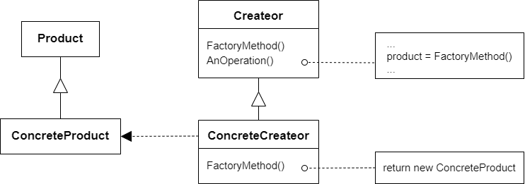

# 工厂方法模式 Factory Method

## 动机

在软件系统中，经常面临着创建对象的工作；由于需求的变化，需要创建的对象的具体类型经常变化

:question: 如何应对这种变化？如何绕过常规的对象创建方法（new），提供一种“封装机制”来避免客户程序和这种“具体对象创建工作”的紧耦合

## 模式定义

工厂方法模式是一种创建型设计模式，父类定义一个用于创建对象的接口，让子类决定实例化哪一个类  
工厂方法使得一个类的实例化延迟（目的：解耦，手段：虚函数）到子类

<div align="center"></div>

## 例子

### 例 1

需求：做一个分割器（包括 TXT 分割器，二进制分割器等）给应用部分调用

```cpp
class ISplitter
{
public:
    virtual void Split() = 0;
    virtual ~ISplitter() {};
};

class BinarySplitter : public ISplitter {};
class TxtSplitter : public ISplitter {};
class PictureSplitter : public ISplitter {};

// 应用
class MainForm
{
public:
    void Button1Click()
    {
        ISplitter* splitter = new BinarySplitter();
        splitter->Split();
    }
};
```

可以看出在应用时，必须 new 出具体类，使得依赖紧耦合

```cpp
// 抽象类
class ISplitter
{
public:
    virtual void Split() = 0;
    virtual ~ISplitter() {};
};
// 具体基类
class BinarySplitter : public ISplitter {};
class TxtSplitter : public ISplitter {};
class PictureSplitter : public ISplitter {};

// 工厂基类
class SplitterFactory
{
public:
    ISplitter* CreateSplitter() = 0;
    virtual ~SplitterFactory() {};
};

// 具体工厂
class BinarySplitterFactory : public SplitterFactory
{
public:
    ISplitter* CreateSplitter() override
    {
        return new BinarySplitter();
    }
};
class TxtSplitterFactory : public SplitterFactory
{
public:
    ISplitter* CreateSplitter() override
    {
        return new TxtSplitter();
    }
};
class PictureSplitterFactory : public SplitterFactory
{
public:
    ISplitter* CreateSplitter() override
    {
        return new PictureSplitter();
    }
};

// 应用
class MainForm
{
private:
    SplitterFactoty* factory_;
public:
    MainForm(SplitterFactory* factory) :
        factory_(factory) {}
    void Button1Click()
    {
        ISplitter* splitter = factory->CreateSplitter(); // 多态new
        splitter->Split();
    }
};
```

上述代码中，将 new 的具体基类放到运行时生成，这样 MainForm 本身只需要依赖一个抽象工厂基类。

### 例 2

```cpp
#include <string>
#include <iostream>

class Product
{
public:
    virtual ~Product() {}
    virtual std::string Operator() const = 0;
};

class ConcreteProduct1 : public Product
{
public:
    std::string Operator() const override
    {
        return "{Result of ConcreteProduct1}";
    }
};

class ConcreteProduct2 : public Product
{
public:
    std::string Operator() const override
    {
        return "{Result of ConcreteProduct2}";
    }
};

class Creator
{
public:
    virtual ~Creator() {}
    virtual Product* FactoryMethod() const = 0;
    std::string SomeOperation() const
    {
        Product* product = this->FactoryMethod();
        std::string resutlt = "Creator: The same creator's code has just worked with " + product->Operator();
        delete product;
        return resutlt;
    }
};

class ConcreteCreator1 : public Creator
{
public:
    Product* FactoryMethod() const override
    {
        return new ConcreteProduct1();
    }
};

class ConcreteCreator2 : public Creator
{
public:
    Product* FactoryMethod() const override
    {
        return new ConcreteProduct2();
    }
};

void ClientCode(const Creator& creator)
{
    std::cout << "Client: I'm not aware of the creator's class, but it still works.\n"
              << creator.SomeOperation() << std::endl;
}

int main(int argc, char* argv[])
{
    std::cout << "App: Launched with the ConcreteCreator1.\n";
    Creator* creator = new ConcreteCreator1();
    ClientCode(*creator);
    std::cout << std::endl;
    std::cout << "App: Launched with the ConcreteCreator2.\n";
    Creator* creator2 = new ConcreteCreator2();
    ClientCode(*creator2);
    std::cout << std::endl;

    delete creator;
    delete creator2;
    return 0;
}
```

此例子不是很好，`Creator`对象有了`SomeOperation`方法，应将`Creator`类只作为创建类，剔除非创建的其他方法（如`SomeOperation`），用其他模式进行封装额外的方法

## 应用场景

- 当你在编写代码的过程中，如果无法预知对象确切类别及其依赖关系时  
  工厂方法将创建产品的代码与实际使用产品的代码分离，从而能在不影响其他代码的情况下扩展产品创建部分代码
- 如果你希望用户能扩展你软件库或框架的内部组件时  
  继承可能是扩展软件库或框架默认行为的最简单方法，但是当你使用子类替代标准组件时，框架如何辨识出该子类？解决方案是将各种框架中构造组件的代码集中到单个工厂方法中，并在继承该组件之外允许任何人对该方法进行重写
- 如果你希望复用现有对象来节省系统资源，而不是每次都重新创建对象，可使用工厂方法

## 优缺点

| <div style="width:200px">优点</div>                                                                                                                                                                           | 缺点                                                                                                                |
| ------------------------------------------------------------------------------------------------------------------------------------------------------------------------------------------------------------- | ------------------------------------------------------------------------------------------------------------------- |
| 1. 你可以避免创建者和具体产品之间的紧密耦合 <br> 2. 单一职责原则。你可以将产品创建代码放在程序的单一位置，从而使得代码更容易维护 <br> 3. 开闭原则。无需更改现有的客户端代码，你就可以在程序中引入新的类型产品 | 1. 应用工厂方法模式需要引入许多新的子类，代码可能会因此变得更复杂。最好的情况是将该模式引入创建者类的现有层次结构中 |

## 要点总结

- Factory Method 模式用于隔离类对象的使用者和具体类型之间的耦合关系。面对一个经常变化的具体类型，紧耦合关系（new）会导致软件的脆弱
- Factory Method 模式通过面向对象的手法，将所要创建的具体对象工作延迟到子类，从而实现一种扩展（而非更改）的策略，较好地解决了这种紧耦合关系
- Factory Method 模式解决“单个对象”的需求变化。缺点在于要求创建方法/参数相同

## 与其他模式的关系

- 在许多设计工作的初期都会使用`工厂方法模式`（较为简单，可以更方便地通过子类进行定制），随后演化为使用`抽象工厂模式`、`原型模式`或`构建器模式`（更灵活但更复杂）
- `抽象工厂模式`通常基于一组`工厂方法`，但你也可以使用`原型模式`来生成这些类的方法
- 可以同时使用`工厂方法`和`迭代器模式`来让子类集合返回不同类型的迭代器，并使得迭代器与集合相匹配
- `原型`并不是基于继承，因此没有继承的缺点。另一方面，原型需要对被复制对象进行复杂的初始化。`工厂方法`基于继承，但是它不需要初始化步骤
- `工厂方法`是`模板方法模式`的一种特殊形式，同时工厂方法可以作为一个大型模板方法的一个步骤
