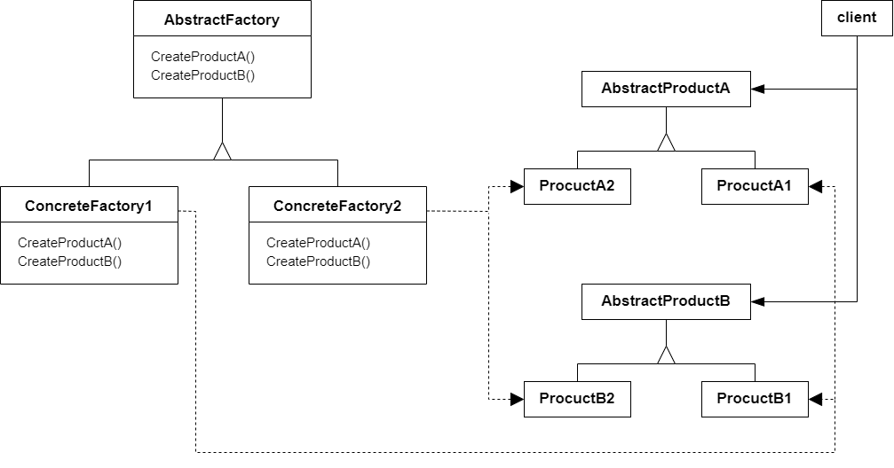

# 抽象工厂模式 Abstract Factory

## 动机

在软件系统中，经常面临着“一系列相互依赖的对象”的创建工作；同时，由于需求的变化，往往存在更多系列对象的创建工作

:question: 如何应对这种变化？如何绕过常规的对象创建方法（new），提供一种“封装机制”来避免客户程序和这种“多系列具体对象创建工作”的紧耦合？

## 模式定义

抽象工厂模式是一种创建型设计模式，它提供一个接口，让该接口负责创建一系列“相关或者相互依赖的对象”，无需指定它们具体的类

<div align="center"></div>

## 例子

### 例 1

原始需求：一个 sqlserver 的连接、操作和读取

```cpp
class EmployeeDAO
{
public:
    vector<EmployeeDO> GetEmployees()
    {
        SqlConnection* connection = new SqlConnection();
        connection->ConnectionString = "...";

        SqlCommand* command = new SqlCommand();
        command->CommmandText = "...";

        SqlDataReader* reader = command->ExecuteReader();
        while(reader->Read()) { }
    }
}
```

需求 2：需要支持多种数据库的动作。那么需要面向对象接口编程，建立一个数据库访问的基类

```cpp
// 数据库访问有关的纯虚基类
class IDBConnection {}
class IDBCommand {}
class IDataReader {}

// 具体类
// sqlserver
class SqlConnection : public IDBConnection {}
class SqlCommand : public IDBCommand {}
class SqlDataReader : public IDataReader {}
// 支持Oracle
class OracleConnection : public IDBConnection {}
class OracleCommand : public IDBCommand {}
class OracleDataReader : public IDataReader {}

// 使用
class EmployeeDAO
{
public:
    vector<EmployeeDO> GetEmployees()
    {
        IDBConnection* connection = new SqlConnection();
        connection->ConnectionString = "...";

        IDBCommand* command = new SqlCommand();
        command->CommmandText = "...";

        IDataReader* reader = command->ExecuteReader();
        while(reader->Read()) { }
    }
}

// 可以看出上述代码的new出对象的问题没有得到解决，那么可以使用工厂方法来进行改善
// 同样需要三个工厂纯虚基类
class IDBConnectionFactory
{
public:
    virtual IDBConnection* CreateDBConnection() = 0;
};
class IDBCommandFactory
{
public:
    virtual IDBCommand* CreateDBCommand() = 0;
};
class IDataReaderFactory
{
public:
    virtual IDataReader* CreateDataReader() = 0;
};

// 具体工厂对象
// sqlserver
class SqlConnectionFactory : public IDBConnectionFactory {}
class SqlCommandFactory : public IDBCommandFactory {}
class SqlDataReader : public IDataReaderFactory {}
// Oracle
class OracleConnectionFactory : public IDBConnectionFactory {}
class OracleCommandFactory : public IDBCommandFactory {}
class OracleDataReader : public IDataReaderFactory {}

// 那么使用方式变成如下
class EmployeeDAO
{
    IDBConenctionFactory* dbConnectionFactory;
    IDBCommandFactory* dbCommandFactory;
    IDataReaderFactory* dbReaderFactory;
public:
    vector<EmployeeDO> GetEmployees()
    {
        IDBConnection* connection = dbConnectionFactory->CreateDBConnection();
        connection->ConnectionString("...");

        IDBCommand* command = dbCommandFactory->CreateDBCommand();
        command->CommmandText = ("...");
        command->SetConnection(connection); // 关联性

        IDataReader* reader = command->ExecuteReader(); // 关联性
        while(reader->Read()) { }
    }
}
```

上述代码中，不难发现，IDBConnection 和 IDBCommand 以及 IDataReader 均具有关联性，那么分开写三个工厂就不是很好的选择，改善办法就是把三个工厂类合并成一个，保证了关联性，不会出现 SqlSever 用到 Oracle 情况。代码如下：

```cpp
// 三个工厂合并成一个工厂纯虚基类
class IDBFactory
{
public:
    virtual IDBConnection* CreateDBConnection() = 0;
    virtual IDBCommand* CreateDBCommand() = 0;
    virtual IDataReader* CreateDataReader() = 0;
};

// 具体工厂类
class SqlDBFactory : public IDBFactory
{
public:
    IDBConnection* CreateDBConnection() override {}
    IDBCommand* CreateDBCommand() override {}
    IDataReader* CreateDataReader() override {}
};

// 使用
class EmployeeDAO
{
    IDBFactory* dbFactory;
public:
    vector<EmployeeDO> GetEmployees()
    {
        IDBConnection* connection = dbFactory->CreateDBConnection();
        connection->ConnectionString("...");

        IDBCommand* command = dbFactory->CreateDBCommand();
        command->CommmandText = ("...");
        command->SetConnection(connection); // 关联性

        IDataReader* reader = command->ExecuteReader(); // 关联性
        while(reader->Read()) { }
    }
}
```

### 例 2

```cpp
#include <string>
#include <iostream>

class AbstructProductA
{
public:
    virtual ~AbstructProductA(){};
    virtual std::string UsefulFunctionA() const = 0;
};

class ConcreteProductA1 : public AbstructProductA
{
public:
    std::string UsefulFunctionA() const override
    {
        return "The result of the product A1.";
    }
};

class ConcreteProductA2 : public AbstructProductA
{
public:
    std::string UsefulFunctionA() const override
    {
        return "The result of the product A2.";
    }
};

class AbstructProductB
{
public:
    virtual ~AbstructProductB(){};
    virtual std::string UsefulFunctionB() const = 0;
    virtual std::string AnotherUsefulFunctionB(const AbstructProductA& collaborator) const = 0;
};

class ConcreteProductB1 : public AbstructProductB
{
public:
    std::string UsefulFunctionB() const override
    {
        return "The result of product B1.";
    }
    std::string AnotherUsefulFunctionB(const AbstructProductA& collaborator) const override
    {
        const std::string result = collaborator.UsefulFunctionA();
        return "The result of the B1 collaborating with ( " + result + " )";
    }
};

class ConcreteProductB2 : public AbstructProductB
{
public:
    std::string UsefulFunctionB() const override
    {
        return "The result of product B2.";
    }
    std::string AnotherUsefulFunctionB(const AbstructProductA& collaborator) const override
    {
        const std::string result = collaborator.UsefulFunctionA();
        return "The result of the B2 collaborating with ( " + result + " )";
    }
};

class AbstractFactory
{
public:
    virtual AbstructProductA* CreateProductA() const = 0;
    virtual AbstructProductB* CreateProductB() const = 0;
};

class ConcreteFactory1 : public AbstractFactory
{
public:
    AbstructProductA* CreateProductA() const override
    {
        return new ConcreteProductA1();
    }
    AbstructProductB* CreateProductB() const override
    {
        return new ConcreteProductB1();
    }
};

class ConcreteFactory2 : public AbstractFactory
{
public:
    AbstructProductA* CreateProductA() const override
    {
        return new ConcreteProductA2();
    }
    AbstructProductB* CreateProductB() const override
    {
        return new ConcreteProductB2();
    }
};

void ClientCode(const AbstractFactory& factory)
{
    const AbstructProductA* product_a = factory.CreateProductA();
    const AbstructProductB* product_b = factory.CreateProductB();
    std::cout << product_b->UsefulFunctionB() << std::endl;
    std::cout << product_b->AnotherUsefulFunctionB(*product_a) << std::endl;
    delete product_a;
    delete product_b;
}

int main(int argc, char* argv[])
{
    std::cout << "Client: Test client code with the first factory type:\n";
    ConcreteFactory1* f1 = new ConcreteFactory1();
    ClientCode(*f1);
    delete f1;
    std::cout << std::endl;
    std::cout << "Client: Test the same client code with the second factory type:\n";
    ConcreteFactory2* f2 = new ConcreteFactory2();
    ClientCode(*f2);
    delete f2;
    return 0;
}
```

## 应用场景

- 如果代码需要与多个不同系列的相关产品交互，但是由于无法提前获取相关信息，或者处于对未来扩展性的考虑，你不喜欢代码基于产品的具体类进行构造，在这种情况下，可以使用抽象工厂  
  抽象工厂为你提供了一个接口，可用于创建每个系列产品的对象。只要代码通过该接口创建对象，那么就不会生成与应用程序已经生成的产品类型不一致的产品
- 如果你有一个基于一组抽象方法的类，且其主要功能因此变得不明确，那么在这种情况下可以考虑使用抽象工厂模式  
  在设计良好的程序中，每个类仅负责一件事。如果一个类与多种类型产品交互，就可以考虑将工厂方法抽取到独立的工厂类或具备完整功能的抽象工厂类中

## 优缺点

| <div style="width:200px">优点</div>                                                                                                                                                                                             | 缺点                                                                    |
| ------------------------------------------------------------------------------------------------------------------------------------------------------------------------------------------------------------------------------- | ----------------------------------------------------------------------- |
| 1. 你可以确保同一工厂的产品相互匹配 <br> 2. 你可以避免客户端和具体产品代码的耦合 <br> 3. 单一职责原则。你可以将产品生成代码抽取到同一位置，使得代码易于维护 <br> 4.开闭原则。向应用程序中引入新产品变体时，你无需修改客户端代码 | 1. 由于采用该模式需要向应用中引入众多接口和类，代码可能会比之前更加复杂 |

## 要点总结

- 如果没有应对“多系列对象构建”的需求变化，则没有必要使用 Abstract Factory 模式，这时候使用简单的工厂完全可以
- “系列对象”指的是在某一特定系列下的对象之间有相互依赖、或者作用的关系。不同系列的对象之间不能相互依赖
- Abstract Factory 模式主要在于应对“新系列”的需求变动。其缺点在于难以应对“新对象”的需求变动

## 与其他模式的关系

- 在许多设计工作的初期都会使用`工厂方法模式`（较为简单，可以更方便地通过子类进行定制），随后演化为使用`抽象工厂模式`、`原型模式`或`构建器模式`（更灵活但更复杂）
- `抽象工厂模式`通常基于一组`工厂方法`，但你也可以使用`原型模式`来生成这些类的方法
- `构建器`重点关注如何分步生成复杂对象，`抽象工厂`专门用于生产一系列相关对象。`抽象工厂`会马上返回产品，`构建器则`允许你在获取产品前执行一些额外构造步骤
- 当只需对客户端代码隐藏子系统创建对象的方式时，你可以使用`抽象工厂`来代替`门面模式`
- 你可以将`抽象工厂`和`桥接模式`搭配使用。如果由桥接定义的抽象只能与特定实现合作，这一模式搭配就非常有用。在这种情况下，抽象工厂可以对这些关系进行封装，并且对客户端代码隐藏其复杂性
- `抽象工厂`、`构建器`和`原型`都可以用`单例模式`来实现
