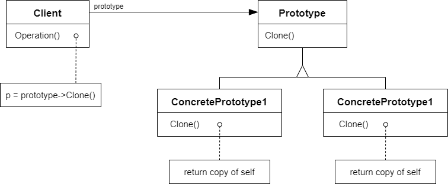

# 原型模式

## 动机

在软件系统中，经常面临着“某些结构复杂的对象”的创建工作；由于需求的变化，这些对象经常面临着剧烈的变化，但是它们却拥有比较稳定的一致的接口

:question: 如果应对这种变化？如何向“客户程序（使用这些对象的程序）“隔离出“这些易变对象”的客户程序“不随着需求改变而改变”？

## 模式定义

使用原型实例指定创建对象的种类，然后通过拷贝（深拷贝）这些原型来创建新的对象

<div align="center"></div>

## 例子

原型模式和工厂模式的结构有点类似，可对比参考代码

```cpp
// 抽象类 -- 这里和工厂模式区别在于通过clone方法去创建一个对象
class ISplitter
{
public:
    virtual void split() = 0;
    virtual ISplitter* clone() = 0;

    virtual ~ISplitter() {}
};

// 具体类
class BinarySplitter : public ISplitter
{
public:
    virtual ISplitter* clone()
    {
        return new BinarySplitter(*this);
    }
};
class TxtSplitter : public ISplitter
{
public:
    virtual ISplitter* clone()
    {
        return new TxtSplitter(*this);
    }
};

// 应用
class MainForm
{
    ISplitter* prototype;
public:
    MainForm(ISplitter* prototype)
    {
        this->prototype = prototype;
    }

    void Button1_Click()
    {
        ISplitter* splitter = prototype->clone();
        splitter->split();
    }
};
```

## 要点总结

- Prototype 模式同样用于隔离类对象的使用者和具体类型（易变类）之间的耦合关系，它同样要求这些“易变类”拥有“稳定的接口”
- Prototype 模式对于“如何创建易变类的实体对象”采用“原型克隆”的方法来做，它使得我们可以非常灵活地动态创建“拥有某些稳定接口”的新对象--所需工作仅仅是注册一个新类的对象（即原型），然后在任何需要的地方 Clone
- Prototype 模式中 Clone 方法可以利用某些框架中的序列化来实现深拷贝
