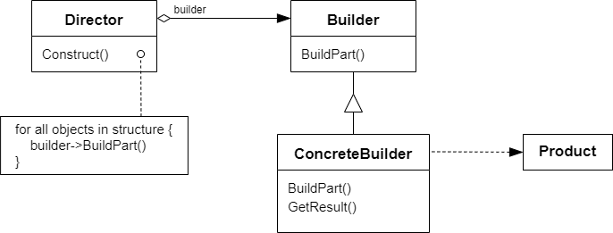

# 构建器模式 Builder

## 动机

在软件系统中，有时候面临着“一个复杂对象”的创建工作，其通常由各个部分子对象用一定的算法构成；由于需求的变化，这个复杂对象的各个部分经常面临着剧烈的变化，但是将它们组合在一起的算法却相对稳定

:question: 如何应对这种变化？如何提供一种“封装机制”来隔离出“复杂对象的各个部分”的变化，从而保持系统中的“稳定构建算法”不随着需求改变而改变？

## 模式定义

构建器模式是一种创建型设计模式，使你能够分步骤创建复杂对象。该模式允许你使用相同的创建代码生成不同类型和形式的对象

将一个复杂对象的构建与其表示相分离，使得同样的构建过程（稳定）可以创建不同的表示（变化）

<div align="center"></div>

## 例子

### 例 1

需求：建造一个房子（木房子、石头房子）等，可能有步骤 12345

```cpp
class House
{
public:
    void Init()
    {
        this->BuildPart1();

        for (int i = 0; i < 4; ++i)
        {
            pHouseBuilder->BuildPart2();
        }

        bool flag = this->BuildPart3();

        if (flag)
        {
            this->BuildPart4();
        }

        this->BuildPart5();
    }

    virtual ~House() {}

protected:
    virtual void BuildPart1() = 0;
    virtual void BuildPart2() = 0;
    virtual void BuildPart3() = 0;
    virtual void BuildPart4() = 0;
    virtual void BuildPart5() = 0;
};

// 石头房子
class StoneHouse : public House
{
protected:
    void BuildPart1() override {}
    void BuildPart2() override {}
    void BuildPart3() override {}
    void BuildPart4() override {}
    void BuildPart5() override {}
};
```

其实上述代码也没有问题，不过还有优化空间。稳定的部分 Init 函数可以单独提出来，再把变化的部分（虚函数部分）提出来。

```cpp
class House {};

class HouseBuilder
{
public:
    House* GetResult()
    {
         return house_;
    }
    virtual ~HouseBuilder() {}

protected:
    House* house_;
    virtual void BuildPart1() = 0;
    virtual void BuildPart2() = 0;
    virtual void BuildPart3() = 0;
    virtual void BuildPart4() = 0;
    virtual void BuildPart5() = 0;
};

class StoneHouse : public House {};
class StoneHouseBuilder : public HouseBuilder
{
protected:
    void BuildPart1() override {}
    void BuildPart2() override {}
    void BuildPart3() override {}
    void BuildPart4() override {}
    void BuildPart5() override {}
}

// 应用
class HouseDirector
{
public:
    HouseBuilder* housebuilder_;

    HouseDirector(HouseBuilder* housebuilder)
    {
        housebuilder_ = housebuilder;
    }

    House* Construct()
    {
        housebuilder_->BuildPart1();

        for (int i = 0; i < 4; ++i)
        {
            housebuilder_->BuildPart2();
        }

        bool flag = housebuilder_->BuildPart3();

        if (flag)
        {
            housebuilder_->BuildPart4();
        }

        housebuilder_->BuildPart5();

        return housebuilder_->GetResult();
    }
}
```

### 例 2

```cpp
#include <vector>
#include <string>
#include <iostream>

class Product1
{
public:
    std::vector<std::string> parts_;

    void ListParts() const
    {
        std::cout << "Product parts: ";
        for (size_t i = 0; i < parts_.size(); ++i)
        {
            if (parts_[i] == parts_.back())
                std::cout << parts_[i];
            else
                std::cout << parts_[i] << ", ";
        }
        std::cout << "\n\n";
    }
};

class Builder
{
public:
    virtual ~Builder() {}
    virtual void ProducePartA() const = 0;
    virtual void ProducePartB() const = 0;
    virtual void ProducePartC() const = 0;
};

class ConcreteBuilder1 : public Builder
{
private:
    Product1* product;

public:
    ConcreteBuilder1()
    {
        this->Reset();
    }
    ~ConcreteBuilder1()
    {
        delete product;
    }
    void Reset()
    {
        this->product = new Product1();
    }
    void ProducePartA() const override
    {
        this->product->parts_.push_back("PartA1");
    }
    void ProducePartB() const override
    {
        this->product->parts_.push_back("PartB1");
    }
    void ProducePartC() const override
    {
        this->product->parts_.push_back("PartC1");
    }
    Product1* GetProduct()
    {
        Product1* result = this->product;
        this->Reset();
        return result;
    }
};

class Director
{
private:
    Builder* builder;

public:
    void SetBuilder(Builder* builder)
    {
        this->builder = builder;
    }
    void BuildMinimalViableProduct()
    {
        this->builder->ProducePartA();
    }
    void BuildFullFeaturedProduct()
    {
        this->builder->ProducePartA();
        this->builder->ProducePartB();
        this->builder->ProducePartC();
    }
};

void ClientCode(Director& director)
{
    ConcreteBuilder1* builder = new ConcreteBuilder1();
    director.SetBuilder(builder);
    std::cout << "Standard basic product:\n";
    director.BuildMinimalViableProduct();

    Product1* p = builder->GetProduct();
    p->ListParts();
    delete p;

    std::cout << "Standard full featured product:\n";
    director.BuildFullFeaturedProduct();

    p = builder->GetProduct();
    p->ListParts();
    delete p;

    std::cout << "Custom product:\n";
    builder->ProducePartA();
    builder->ProducePartC();
    p = builder->GetProduct();
    p->ListParts();
    delete p;

    delete builder;
}

int main(int argc, char* argv[])
{
    Director* director = new Director();
    ClientCode(*director);
    delete director;
    return 0;
}
```

## 应用场景

- 使用构建器模式可避免“重叠构造函数”的出现  
  假设你的构造函数中有 10 个可选参数，那么调用该函数会非常不方便。因此，你需要重载这个构造函数，新建只有几个较少参数的简化版。但这些构造函数仍需要调用主构造函数，传递一些默认数值来替代省略掉的参数。构建器模式可以让你分步骤生成对象，而且允许你仅使用必须的步骤。应用该模式后，你再也不需要将几十个参数塞进构造函数里面
- 当你希望使用代码创建不同形式的产品（例如石头或木头房屋）时，可使用构建器模式  
  如果你需要创建的各种形式的产品，它们的制造过程相似且仅有细节上的差异，此时可使用构建器模式。基本构建器接口中定义了所有可能的制造步骤，具体构建器将实现这些步骤来制造特定形式的产品。同时，主管类将负责管理制造步骤的顺序
- 使用构建器构造组合树或其他复杂对象  
  构建器模式让你能分步骤构造产品。你可以延迟执行某些步骤而不会影响最终产品。你甚至可以递归调用这些步骤，这在创建对象树时非常方便

## 优缺点

| <div style="width:200px">优点</div>                                                                                                                                               | 缺点                                                        |
| --------------------------------------------------------------------------------------------------------------------------------------------------------------------------------- | ----------------------------------------------------------- |
| 1. 你可以分步创建对象，暂缓创建步骤或递归运行创建步骤 <br> 2. 生成不同形式的产品时，你可以复用相同的制造代码 <br> 3. 单一职责原则。你可以将复杂构造代码从产品的业务逻辑中分离出来 | 1. 由于该模式需要新增多个类，因此代码整体复杂程度会有所增加 |

## 要点总结

- Builder 模式主要用于“分步骤构建一个复杂的对象”。在这其中“分步骤”是一个稳定的算法，而复杂对象的各个部分则经常变化
- 变化点在哪里，封装在哪 -- Builder 模式主要在于应对“复杂对象各个部分”的频繁需求变动。其缺点在于难以应对“分步骤构建算法”的频繁需求变动
- 在 Builder 模式中，要注意不同语言中构造器内调用虚函数的差别

## 与其他模式的关系

- 在许多设计工作的初期都会使用`工厂方法模式`（较为简单，可以更方便地通过子类进行定制），随后演化为使用`抽象工厂模式`、`原型模式`或`构建器模式`（更灵活但更复杂）
- `构建器`重点关注如何分步生成复杂对象，`抽象工厂`专门用于生产一系列相关对象。`抽象工厂`会马上返回产品，`构建器`则允许你在获取产品前执行一些额外构造步骤
- 可以在创建复杂`组合模式树`时使用`构建器`，因为这可使其构造步骤以递归的方式运行
- 可以结合使用`构建器`和`桥接模式`：主管类负责抽象工作，各种不同的构建器负责实现工作
- `抽象工厂`、 `构建器`和`原型`都可以用`单例模式`来实现
